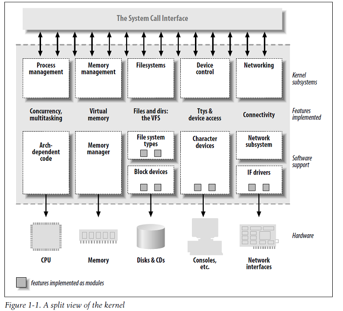

# 设备驱动程序本质

- 为了操作某个硬件而向内部定义一个编程接口，这些接口隐藏了操作设备所需要的工作细节。用户通过操作一组标准化的调用执行操作，而且这些调用独立于特定的驱动程序。将这些调用映射并且作用到硬件的设备特有操作是驱动程序的任务。例如，LDD3 书中的 SCULL 例子：我们对于设备的操作不局限于驱动对外提供给用户的使用方法，使用系统调用`open`、`write`、`read`等操作就可以完成对硬件的操作（写入、读取数据），而且用户不需要担心输入的数据在内存中的保存格式。

## 设备驱动程序特性

1. 首先，驱动的作用是提供对硬件的操作接口，它主要的作用在于**机制** ( 需要提供什么功能 ) 而`不是`**策略** ( 如何使用这些功能 ) 。
2. 在编写驱动程序时，注意：编写访问硬件的内核代码时，不要给用户强加任何特定策略，驱动只需要处理如何使硬件可用的问题上，而使用则是上层的问题。
3. 驱动程序设计主要考虑的三个方面：
    1. 提供给用户尽量多的选择
    2. 编写驱动程序要占用的时间
    3. 尽量保持简单而不至于错误丛生。
4. 不带策略的驱动程序包括的一些典型的特征：
    1. 同时支持同步和异步操作
    2. 驱动程序能被多次打开、充分利用硬件特性
    3. 不具备用来简化任务的或提供与策略相关的软件层。

## 内核功能划分 (Splitting the Kernel)

1. 进程管理 *(Process management)* ：进程管理功能负责创建和销毁进程，并处理他们和外部世界的通信(输入和输出)。进程间通信的各种应用也都是由内核完成。概括来说内核进程管理活动就是在单个或多个 CPU上 实现了多个进程的抽象。
2. 内存管理 *(Memory management)* ：内核在有限的可用资源上为每个进程都创建了一个虚拟地址空间，并且实现了一套有关内存分配 malloc\free 等函数组。
3. 文件系统 *(Filesystems)* ：Linux 支持多种文件系统类型，也就是在物理介质上组织数据的不同方式。内核在没有结构的硬件上构造结构化的文件系统，并且文件抽象在整个文件系统中广泛使用。
4. 设备控制 *(Device control)* ：几乎每一个系统操作最终都会映射到物理设备上，所有设备的操作都由相关的驱动代码来完成。内核必须为每一件硬件外设嵌入相应的驱动程序。这块是本书的重点。
5. 网络功能 *(Networking)* ：网络功能之所以由系统来管理是因为大部分网络操作和具体的进程无关：数据包的传入是异步事件。系统负责在程序和网络接口之间传递数据包。另外所有的路由和地址解析都是由内核处理的。

## 可装载模块 (Loadable Modules)

- Linux 的特性可以在运行时向内核中添加功能或是移除功能。这些功能代码被称为“模块”，我们使用 insmod 添加模块 rmmod 移除模块。内核支持多种模块如下图：

## 设备和模块划分 (Classes of Devices and Modules)

- Linux系统将设备分成三种基本类型，每个模块通常实现其中一类：字符模块、块模块 或 网络模块。但是这种模块划分成不同类型的方式不是严格的，由编写者可自己进行概括拓展，或将不同类型的设备驱动包括到一个模块中。
    1. 字符设备 *(Character devices)* ：字符设备是个能够像字节流（类似文件）一样被访问的设备，由字符设备驱动程序来实现这种特性。字符设备驱动至少要实现`open`、`close`、`read`和`write`系统调用。字符设备可以通过文件系统节点来访问，他与普通文件的区别是不能偏移访问地址，只能顺序访问数据通道。
    2. 块设备 *(Block devices)*：与字符设备类似，也有在`/dev`下的文件系统节点。但是块设备上能容纳文件系统。他与字符设备的区别仅仅是在于内核内部管理数据的方式，也就是内核及驱动程序间的软件接口。
    3. 网络接口 *(Network interfaces)* ：需要有最基本的网络接口，即一个可以与其他主机交换数据的设备，接口可以是硬件接口（网卡），或者纯软件设备（回环）。网络接口由内核中的网络子系统驱动，负责发送和接收数据包，但它不需要了解每件事物如何映射到实际传输的数据包。
        - 由于不是面向流的设备，因此想要映射到文件系统中的节点比较困难。Unix访问的方法仍然是给他们分配一个唯一的名字（eth0），内核调用一套和数据包传输相关的函数而不是read和write等。

安全问题 *(Security Issues)* ：系统中所有的安全检查都是由内核代码进行的，如果内核有安全漏洞，则整个系统都有安全问题，因此只有超级用户才有权力装载模块。

版本标号 *(Version Numbering)* ：对内核来讲，偶数编号的内核版本适用于正式发行的稳定版本，而奇数版本是开发过程中的一个快照，很快会被下一个版本更新。
