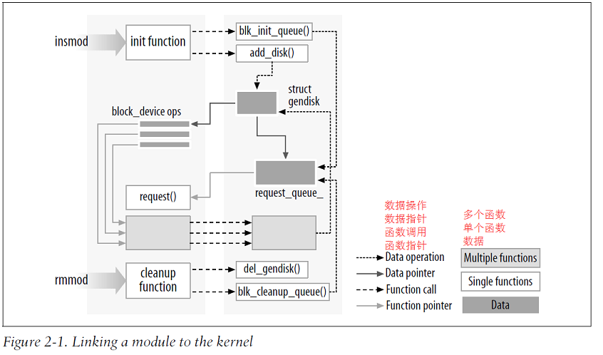
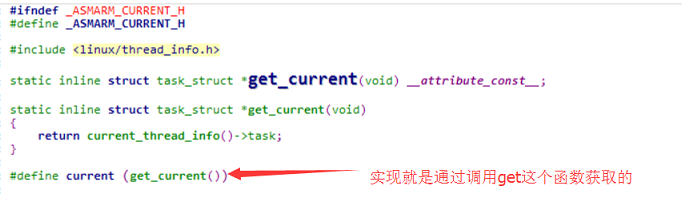
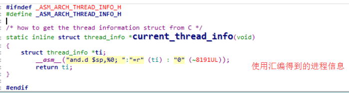
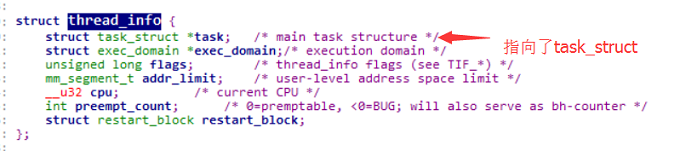
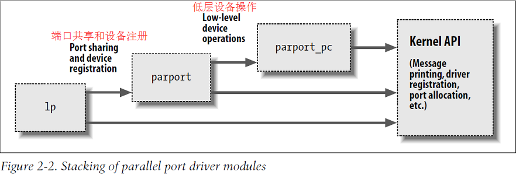

# Hello World 模块

```c
/*
* $Id: hello.c,v 1.5 2004/10/26 03:32:21 corbet Exp $
*/
#include <linux/init.h>
#include <linux/module.h>
MODULE_LICENSE("Dual BSD/GPL");

static int hello_init(void)
{
    printk(KERN_ALERT "Hello, world\n");
    return 0;
}

static void hello_exit(void)
{
    printk(KERN_ALERT "Goodbye, cruel world\n");
}

module_init(hello_init);
module_exit(hello_exit);
```

- `hello_init` 在模块装载时调用，`hello_exit` 在模块被移除时调用。`module_init` 和 `module_exit` 是**两个内核的特殊宏** 用来声明上述两个函数的功能。`MODULE_LICENSE` 宏用来告诉内核，该模块使用的许可证。
- `printk` 函数在 Linux 内核中定义，不依赖 C 库函数。代码中的 `KERN_ALERT` 表示优先级，注意标志后面没有逗号。指定优先级的原因：具有默认优先级消息可能不会输出到控制台上，这依赖于内核版本、`klogd` 守护进程的版本以及具体的配置。
- **`dmesg` 查看内核打印信息**

注意：只有超级用户才有权限加载和卸载某块。

## 内核模块与应用程序对比 (Kernel Modules Versus Applications)

1. 大多数的应用程序**从头到尾执行**单个任务，而模块却只是**预先注册自己**以便服务于将来的某个请求，而初始化函数就仅仅是做注册的工作的，卸载也是同理。
2. 另一个不同是应用程序在退出时可以不管资源的释放或者其他的清除工作，但是模块在退出函数必须要仔仔细细的将初始化函数中所做的一切撤销，否则在系统重启之前某些东西会一直残留在系统中。
3. 应用程序可以调用他并未定义的函数，这是因为连接过程中能够解析外部引用从而使用适当的函数库(ex: printf())，但是在模块中这时不行的因为他是与内核相关联，只能链接到内核中包含的函数(ex: printk是内核定义的)。
4. 另一个不同在于各自环境下处理错误的方式不同：应用程序出现段错误是无害的，还可以使用调试器跟踪到源代码中的问题，而内核错误即使不影响系统，也会杀死当前的进程。

下图反应了在内核中如何使用函数调用和函数指针，为运行中的内核添加新的功能。



## 用户空间和内核空间的区别 (User Space and Kernel Space)

- 模块运行在内核空间，应用程序运行在用户空间。
- 事实上操作系统的作用就是为**应用程序**提供一个对计算机硬件一致的接口。同时操作系统必须保证程序的独立操作并保护资源不受非法访问。这个任务只有在 CPU 能够有权限分级能力保护操作系统不被应用程序破坏才能实现。而保护 CPU 则是通过 CPU 中实现不同的操作模式，通过级别来保护，程序代码能通过有限数目的“门”来从一个级别切换到另一个级别。当前所有的处理器都至少有两个级别。

- 内核空间和用户空间不仅仅是优先级不同，每个模式都有自己的内存映射，即自己的地址空间。
- 每当应用程序执行**系统调用**或者被**硬件中断挂起**时，LUNIX 将执行模式从用户空间切换到内核空间。当执行系统调用时的内核代码运行在进程上下文中，它代表调用进程执行操作，因此可以访问进程地址空间中的所有数据。而处理硬件中断操作的内核代码和进程是异步的，与任何一个特定进程无关，这也是为什么不能给中断处理程序传参数的原因。
- 模块代码在内核空间运行主要执行两类任务：某些函数作为系统调用的一部分而执行，而其他函数则负责中断处理。

## 内核中的并发 (Concurrency in the Kernel )

- 内核编程区别于常见应用程序变成的地方在于并发处理。应用程序整体大多是顺序执行的不需要关心其他事情的影响，但是内核中的代码却不是：同一时刻，可能会有许多事情正在发生。
    1. 首先，Linux 系统中通常正在运行多个并发进程，并且可能有多个进程同时调用同一个驱动程序。
    2. 其次，设备中断驱动程序的运行。因此，Linux 内核代码必须是可重入的，他必须能够同时运行在多个上下文中。
    3. 最后，内核中的数据结构就必须仔细设计保证多个线程分开执行，而避免数据被破坏。

## 当前进程 (The Current Process)

内核代码可通过访问全局项 `current` 来获得当前进程，current 是在 <asm/current.h> 中定义的，他是一个指向 `struct task_struct` 的指针，而 task_struct 结构在 <linux/sched.h> 文件中定义，他是一个进程描述符。current 指针指向当前正在运行的进程。

> Current.h (*kernel_3.0\arch\arm\include\asm)路径



----------------------



----------------------



- 当 open、read 等系统调用的执行过程中，当前进程指的是调用这些系统调用的进程。
- 一种不依赖于特定架构的机制通常是，将指向 `task_struct` 结构的指针隐藏在内核栈中。这种实现的细节同样也对其他内核子系统隐藏，驱动程序在包含头文件的情况下就能直接调用 。

```c
#include <linux/sched.h>
printk(KERN_INFO "The process is \"%s\" (pid %i)\n",current->comm, current->pid);
```

## 其他的一些细节 (A Few Other Details)

- 应用程序在虚拟内存中布局，并具有一大块栈空间。而相反的是内核具有非常小的栈，他可能之和一个 4096 字节大小的页那样小。因此声明大的自动变量不是一个好主意，如果我们需要一个大结构，则应该调用时动态分配结构。
- 内核在创建进程的时候，在创建`task_struct`的同时，会为进程创建相应的堆栈。每个进程会有两个栈，一个用户栈，存在于用户空间，一个内核栈，存在于内核空间。当进程在用户空间运行时，cpu堆栈指针寄存器里面的内容是用户堆栈地址，使用用户栈；当进程在内核空间时，cpu堆栈指针寄存器里面的内容是内核栈空间地址，使用内核栈。
- 内核API中有双下划线前缀(_ _ )的函数名，通常这些调用是接口的底层组件，应谨慎调用。
- 重要的一点，在内核代码中不能实现浮点运算。

> [Linux内核中用户空间栈和内核栈的区别](http://www.68idc.cn/help/makewebs/asks/2014041489864.html)

## 编译和装载 (Compiling and Loading)

### 编译模块 (Compiling Modules)

- 模块的构造过程和用户空间应用程序的构造过程有很大的不同。内核是一个大的、独立的程序，为了使它的各个片段放在一起，要满足很多详细而明确的要求。
    1. 首先有正确版本的编译器、模块工具和其他必要的工具。
    2. 其次就是 [makefile 规则](http://blog.csdn.net/liuhaoyutz/article/details/7382956)

```makefile
# To build modules outside of the kernel tree, we run "make"
# in the kernel source tree; the Makefile these then includes this
# Makefile once again.
# This conditional selects whether we are being included from the
# kernel Makefile or not.
ifeq ($(KERNELRELEASE),)

    # Assume the source tree is where the running kernel was built
    # You should set KERNELDIR in the environment if it's elsewhere
    KERNELDIR ?= /lib/modules/$(shell uname -r)/build
    # The current directory is passed to sub-makes as argument
    PWD := $(shell pwd)

modules:
    $(MAKE) -C $(KERNELDIR) M=$(PWD) modules

modules_install:
    $(MAKE) -C $(KERNELDIR) M=$(PWD) modules_install

clean:
    rm -rf *.o *~ core .depend .*.cmd *.ko *.mod.c .tmp_versions Module.symvers modules.order

.PHONY: modules modules_install clean

else
    # called from kernel build system: just declare what our modules are
    obj-m := hello.o hellop.o seq.o jit.o jiq.o sleepy.o complete.o \
            silly.o faulty.o kdatasize.o kdataalign.o
endif
```

- 当在命令行执行`make`命令时（当前工作目录即模块源文件所在目录），因为当前模块所在目录中里没有符号链接`KERNELRELEASE`**就是说明在用户这里执行的make**，所以执行**非else**部分，即把`KERNELDIR`和`PWD`变量赋值。
- 接下来执行`“$(MAKE) -C $(KERNELDIR) M=$(PWD) modules”`命令。`-C`选项的含义是把目录切换到**KERNELDIR**目录下，然后读取**KERNELDIR**目录下的**Makefile**，`M`选项是让内核的makefile 在构造 `modules` 前切换回模块所在目录，此时由于`KERNELRELEASE`变量已经定义因为是在内核中调用的 make，这是第二次读取我们编写的`makefile`文件，即可以得知需要编译obj-m，这时`modules`目标指向的`obj-m`变量中设定的模块。因此可知内核的 makefile 负责真正构造模块。

### 装载和卸载 (Loading and Unloading Modules)

- 基本`insmod`装载，`rmmod`移除模块。`lsmod`列出模块，他主要是读取`/proc/modules`信息。有关当前已装载模块的信息也可以在 sysfs 虚拟文件系统的 /sys/module 下找到。
- `modprobe`工具：和 insmod 类似，modprobe 也用来将模块装载到内核，不同点是他会考虑是否要装载的模块中是否使用了一些当前内核不存在的符号，如果使用了则在当前搜索路径中搜索定义了这些符号的模块并自动装载。

### 版本依赖 (Version Dependency)

- 模块和特定内核版本定义的数据结构和函数原型紧密关联，因为，一个模块使用的接口可能从一个版本到另一个版本有着巨大的变化。可以使用内核树中的 vermagic.o 文件链接当前要编译的模块，这个文件中有大量的内核信息用来检查匹配问题，出现问题有报错：

```makefile
# insmod hello.ko
Error inserting './hello.ko': -1 Invalid module format
#系统文件日志信息也会有相关信息(/var/log/messages or whatever your system is configured to use)。
```

### 平台依赖 (Platform Dependency)

- 内核代码可以针对某个 CPU 家族的某种特定处理器进行优化，从而充分利用目标平台的特性。如果模块和某个给定的内核工作。他也必须了解目标处理器。vermagic.o再装载时内核会自动检查处理器相关配置是否正确，如果模块选项配置有问题则不会装载模块。
- 如果想要发布：
    1. 使用GPL协议共享。
    2. 源码形式发布，自带编译脚本。
    3. 二进制就很麻烦了。

### [内核符号表](http://blog.csdn.net/trochiluses/article/details/9446955) (The Kernel Symbol Table)

- 我们知道insmod使用公共内核符号表来解析模块中未定义的符号。公共内核符号表中包含了所有的**全局内核项**（即函数和变量）的地址，这是实现模块化驱动程序所必需的。当模块被装入内核后，它所导出的任何内核符号都会变成内核符号表的一部分。在通常情况下，模块只需实现自己的功能，而无需导出任何符号。但是，如果其他模块需要从某个模块中获得需要的符号时，我们也可以导出符号。
- 新模块可以使用由我们**自己的模块**导出的符号，这样，我们可以在其他模块上层叠新的模块。模块层叠技术也使用在很多主流的内核源代码中。例如msdos 文件系统依赖于由 fat 模块导出的符号；而每个USB输入设备模块层叠在 usbcore 和 input 模块之上。
    1. `modprobe` 是处理堆叠模块的一个工具，他可以自动装入指定模块依赖的其他模块，相当于操作 insmod 的多次操作。



- 通过堆叠可以将模块划分成多个层，通过简化每个层缩短开发时间。Linux 内核头文件提供了一个方便的方法来管理符号对模块外部的可见性，从而减少了可能造成的名字空间污染（名字空间中的名称可能会和内核其他地方定义的名称发生冲突），并且适当隐藏信息。如果一个模块需要向其他模块导出符号，则应该使用下面的宏：

```c
EXPORT_SYMBOL(name)；
EXPORT_SYMOBL_GPL(name)；
```

- 这两个宏均用于将给定的符号导出到模块外部。_GPL 版本使得要导出的符号只能被 GPL 许可证下的模块使用。符号必须在模块文件的全局部分导出，不能再函数中导出，这是因为上面的这两个宏将被展开为一个特殊变量的声明，而该变量必须是全局的。该变量将在模块可执行文件的特殊部分（即一个"ELF段"）中保存，在装载时，内核通过这个段来寻找模块导出的变量。

## 预备知识 (Preliminaries)

首先是模块必须的头文件：

```c
#include <linux/module.h>
#include <linux/init.h>
```

`<module.h>`中包含了可装载模块需要的大量符号和函数的定义。`<init.h>` 就是值初始化和清除函数。

模块中还应指定许可证 `MODULE_LICENSE`：

```c
MODULE_LICENSE("GPL");
```

可在模块中描述作者 `MODULE_AUTHOR` 、模块简介 `MODULE_DESCRIPTION` 、版本 `MODULE_VERSION` 、模块的别名 `MODULE_ALIAS` 、告诉用户空间模块所支持的设备 `MODULE_DEVICE_TABLE`。

### 初始化和关闭 (Initialization and Shutdown)

- 模块初始化函数负责注册模块所提供的任何设施。

```c
static int __init initialization_function(void)
{
    /* Initialization code here */
}
module_init(initialization_function);
```

- 首先是声明为 `static`，因为他除了初始化不会被其他调用，但这不是必须的，因为要对内核其他部分可见首先要导出。`_ _init` 标记是对内核的一种暗示，说明该函数仅仅在初始化阶段使用。再装载完成后就会将初始化函数释放掉。

- `module_init` 是强制的，用来说明内核初始化函数所在的位置。

- 模块可以注册许多不同类型的设施，包括不同类型的设备、文件系统、密码交换等。对每种设施都有对应的内核函数完成注册。传递到内核注册函数中的参数通常是指向用来描述新设施及设施名的数据结构指针，而数据结构通常包含指向模块函数的指针，这样，模块函数就可以被调用。

### 清除函数 (The Cleanup Function)

- 每个重要的模块都需要一个清除函数，该函数在模块被移除前注销接口并释放所有资源。

```c
static void __exit cleanup_function(void)
{
    /* Cleanup code here */
}
module_exit(cleanup_function);
```

- 清除函数没有返回值，`_ _exit`修饰词用于标记卸载函数地址，如果模块被直接嵌入内核中，则`__exit`函数被丢弃。
- 如果一个模块没有定义`_ _exit`函数，则内核不允许卸载该模块。

### 初始化过程中的错误 (Error Handling During Initialization)

- 注册设备可能会失败，因此模块代码必须始终检查返回值，并确保所有请求操作都已经成功，有以下几种情况：
    1. 首先遇到错误后判断是否能继续初始化。如果可以继续，通过降低功能继续运转。
    2. 如果错误后不能继续装载模块，则必须将之前所有的注册工作撤销掉。
    3. 错误恢复的处理 有时使用`goto`语句比较有效，撤销顺序与加载顺序相反。
    4. 如果某种原因未能撤销已注册的模块，则内核会处于不稳定状态，需要重新引导系统。

### 模块装载竞争 (Module-Loading Races)

- 在注册完成后，内核的某些部分可能会立即使用我们刚刚注册完的任何设备。就是在初始化函数还在运行时，内核就会调用我们的模块。因此，在用来支持某个设施的所有内部功能初始化完成之前，不要注册任何设施。

### 模块参数 (Module Parameters)

- 由于系统的不同，驱动程序需要的参数也许会发生变化。为了满足这种需求，内核允许对驱动程序指定参数，而这些参数可在装载驱动程序模块时改变。这些参数在`insmod`或`modprobe`命令装在模块时赋值。

LDD3 提供了相应的例子(hellop.ko)：

```c
/*
* $Id: hellop.c,v 1.4 2004/09/26 07:02:43 gregkh Exp $
*/
#include <linux/init.h>
#include <linux/module.h>
#include <linux/moduleparam.h>

MODULE_LICENSE("Dual BSD/GPL");

/*
* These lines, although not shown in the book,
* are needed to make hello.c run properly even when
* your kernel has version support enabled
*/


/*
* A couple of parameters that can be passed in: how many times we say
* hello, and to whom.
*/
static char *whom = "world";
static int howmany = 1;

/*为了使参数对 insmod 可见。参数必须使用 module_param 声明包含三个参数变量名称，类型，最后一个是用于 sysfs 入口项的访问许可掩码。*/
module_param(howmany, int, S_IRUGO);
module_param(whom, charp, S_IRUGO);

static int hello_init(void)
{
    int i;
    for (i = 0; i < howmany; i++)
        printk(KERN_ALERT "(%d) Hello, %s\n", i, whom);
    return 0;
}

static void hello_exit(void)
{
    printk(KERN_ALERT "Goodbye, cruel world\n");
}

module_init(hello_init);
module_exit(hello_exit);
```
