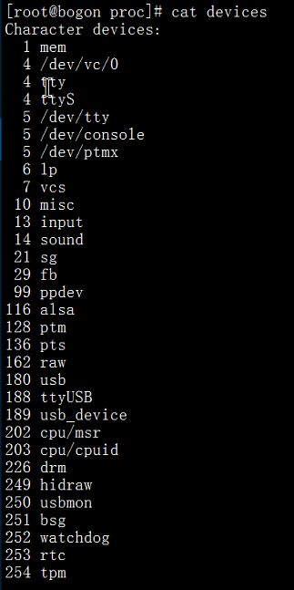
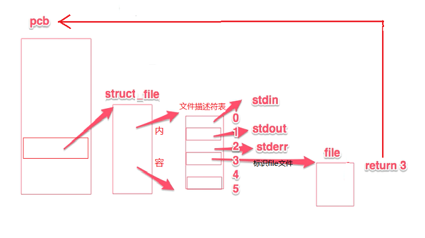
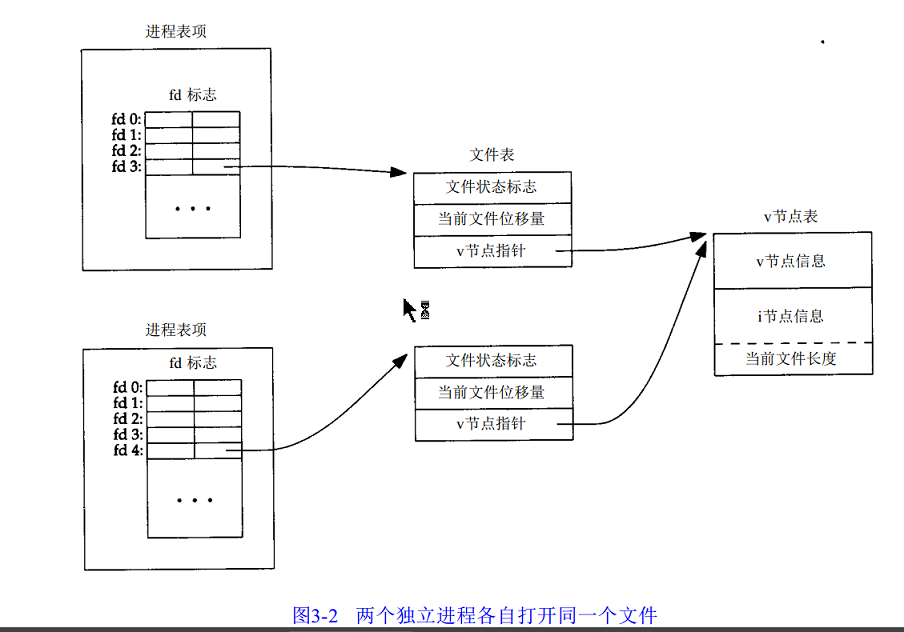
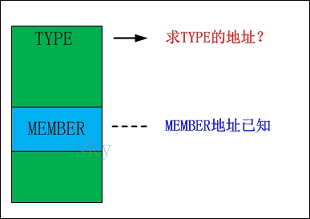
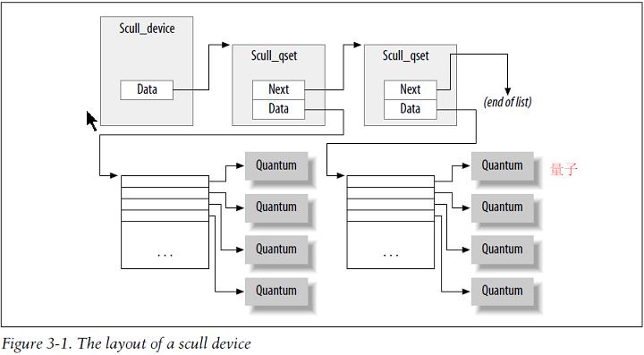
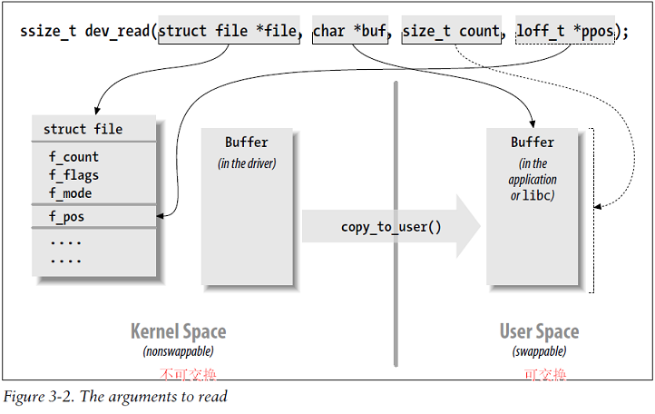

# 字符设备驱动程序

本章主要是编写以个完整的字符驱动 `scull`(Simple Character Utility for Loading Localities)。`scull` 是一个操作内存区域的字符设备驱动程序，所操作的**内存区域**就相当于一个设备。

## scull的设计 *（The Design of scull）*

### 主设备号和次设备号 *（Major and Minor Numbers）*

- 对字符设备的访问是通过文件系统内的设备名称进行的，一种特殊的文件，经常称之为设备节点。字符驱动的特殊文件由使用 `ls -l` 的输出的第一列的 **"c"** 标识，块设备也出现在 `/dev` 中, 但是它们由 **"b"** 标识。
- 使用 `ls -l` 在日期前面的两个数前后分别是主次设备节点。

```c
crw-rw-rw- 1 root root 1(主), 3(次) Apr 11 2002 null
crw------- 1 root root 10,    1     Apr 11 2002 psaux
crw------- 1 root root 4,     1     Oct 28 03:04 tty1
crw-rw-rw- 1 root tty  4,     64    Apr 11 2002 ttys0
crw-rw---- 1 root uucp 4,     65    Apr 11 2002 ttyS1
crw-rw-rw- 1 root root 1,     5     Apr 11 2002 zero
```

- 通常而言，**主设备号** 标识设备对应的驱动程序。例如，`/dev/null` 和 `/dev/zero` 都由驱动 `1` 来管理，现代 Linux 内核允许多个驱动共享主编号，但是大部分设备仍然按照一个主编号一个驱动的原则来组织。
- 次编号被内核用来决定引用哪个设备，除了知道次设备号用来指向驱动程序所实现的设备外，内核本身上不关心关于次设备号的其他信息。

#### **设备标号的内部表示** *（The Internal Representation of Device Numbers）*

- 在内核中，`dev_`t用来保存设备编号，包含主设备与次设备号，`dev_t` 是 `32` 位，`12` 位用作主编号，其余`20` 位用作次编号。
- 用来转化`dev_t`获得设备号的宏`<linux/kdev_t.h>`：

```c
MAJOR(dev_t dev); MINOR(dev_t dev);
```

- 反之转化成`dev_t`：

```c
MKDEV(int major, int minor);
```

#### 分配和释放设备编号 *（Allocating and Freeing Device Numbers）*

- 在建立一个字符设备之前，驱动首先需要一个或多个设备编号。当我们知道所需要的设备编号时使用的函数是 `register_chrdev_region`， 在 <linux/fs.h>中声明：

```c
//first  是要分配的编号范围起始，通常置为0。
//count是所请求的连续设备编号个数。
//name 是和该编号范围关联的设备名称，它会出现在 /proc/devices 和 sysfs 中。
int register_chrdev_region(dev_t first, unsigned int count, char *name);
```

- 不清楚所需的设备编号并且为了防止我们请求的设备编号范围出现问题，可以使用动态分配设备编号：

```c
//dev 仅用于输出的参数，在成功完成调用后保存已分配范围的第一个编号。
// fisetminor 是请求的第一个要使用用的次编号， 它通常是 0
//count 和 name 参数如同给 request_chrdev_region 的一样
int alloc_chrdev_region(dev_t *dev, unsigned int firstminor, unsigned int count, char *name);
```

- 使用完的设备编号都要释放掉，通常在模块的清除函数中调用：

```c
void unregister_chrdev_region(dev_t first, unsigned int count);
```

#### **动态分配主设备号** *（Dynamic Allocation of Major Numbers）*

- 一部分主设备号已经静态的分配给了大部分常见的设备，在内核源码树中`Documentation/devices.txt`有记载。
- 编写一个驱动程序选定一个设备编号是重要的工作，考虑到移植等因素，我们应该首选动态分配主设备号。
- 动态分配的缺点：
  - 由于分配的主设备号不能始终保持一致，所以无法预先创建设备节点，但是 一旦分配了设备号就可以在`/proc/devices`中读取到。
  - 一般在加载这种驱动模块都是使用的脚本，在加载后读取`devices`文件拿到主设备号，创建设备节点。



```shell
#!/bin/sh
module="scullc"
device="scullc"
mode="664"

# Group: since distributions do it differently, look for wheel or use staff
#给定适当的组属性及许可并修改属组
#并非所有的发行版都具有staff组，有些是wheel组
if grep '^staff:' /etc/group > /dev/null; then
    group="staff"
else
    group="wheel"
fi

# remove stale nodes
rm -f /dev/${device}

# invoke insmod with all arguments we got
# and use a pathname, as newer modutils don't look in . by default
#这里传入到该脚本的所有参数调用insmod，同时使用路径来指定模块的位置
/sbin/insmod -f ./$module.ko $* || exit 1

major=`cat /proc/devices | awk " \$2==\"$module\" {print \$1}"`
#mknod Name { b | c } Major Minor
mknod /dev/${device}0 c $major 0
mknod /dev/${device}1 c $major 1
mknod /dev/${device}2 c $major 2
mknod /dev/${device}3 c $major 3
ln -sf ${device}0  /dev/${device}

# give appropriate group/permissions
chgrp $group /dev/${device}[0-3]
chmod $mode  /dev/${device}[0-3]
```

[关于 staff 组和 wheel 组](https://www.2cto.com/os/201310/251533.html)

- 这个脚本也适用其他驱动，只需修改一些名称就可以了。至于脚本最后更改权限组的操作理由是这个脚本必须由超级用户运行，因此新建的特殊文件由 root 拥有， 许可位缺省的是只有 root 有写权限, **而任何人可以读**。通常，一个设备节点需要一个不同的存取策略，因此在某些方面别人的存取权限必须改变。我们的脚本缺省是给一个用户组存取，但是你的需求可能不同。
- 除了 scull_load 之外还有一个 scull_unload 脚本用来清除`/dev` 目录下的相关设备文件并卸载这个模块。

```shell
#!/bin/sh
module="scull"
device="scull"

# invoke rmmod with all arguments we got
/sbin/rmmod $module $* || exit 1

# Remove stale nodes

rm -f /dev/${device} /dev/${device}[0-3]
rm -f /dev/${device}priv
rm -f /dev/${device}pipe /dev/${device}pipe[0-3]
rm -f /dev/${device}single
rm -f /dev/${device}uid
rm -f /dev/${device}wuid</span>
```

- 分配主设备号的最佳方式是：默认采用动态分配，同时保留在加载甚至是编译时指定主设备号的余地。

```c
/*
* Get a range of minor numbers to work with, asking for a dynamic
* major unless directed otherwise at load time.
*/
    if (scull_major) {
        dev = MKDEV(scull_major, scull_minor);
        result = register_chrdev_region(dev, scull_nr_devs, "scull");
    } else {
        result = alloc_chrdev_region(&dev, scull_minor, scull_nr_devs,
                "scull");
        scull_major = MAJOR(dev);
    }
    if (result < 0) {
        printk(KERN_WARNING "scull: can't get major %d\n", scull_major);
        return result;
    }
```

## 一些重要的数据结构 *（Some Important Data Structures）*

- 设备编号注册仅仅是驱动程序代码必须完成的许多工作的第一件事而已，大部分基本的驱动程序 操作涉及到三个重要的内核数据结构，分别是 `file_operations` , `file`  and `inode`。

### 文件操作 *（File Operations）*

- 申请完设备编号之后需要将驱动程序操作连接到这些编号上。`file_operations` 就是为了做这种链接操作的。这个结构定义在`<linux/fs.h>`中，其中包含了一组函数指针。每个已经打开特殊设备文件(内部使用一个 `file` 结构代表)与一组函数集关联( 通过包含一个称为`f_op` 的成员, 它指向一个 file_operations 结构)，这些函数集提供了`open()`、`read()`、`write()`等系统调用的驱动实现函数，也就是说当使用 `read()` 系统调用读取已经打开的设备文件描述符，就会由内核调用关联的函数集中的`read()`实现。

- 通常，`file_operations` 结构或者指向这类结构的指针称为 `fops`。这个结构中的每个成员都应该指向一个驱动程序中对应的实现函数，对于不支持的可以指向 `NULL`。对于指向 `NULL` 的成员内核的处理方式不尽相同，书中有相关的差异介绍以及 fops 中主要成员的介绍。

- scull 设备驱动只实现**最重要**的设备方法，它的 `file_operations` 结构是如下初始化的：

```c
/*
* The fops
*/

struct file_operations scull_fops = {
    .owner =    THIS_MODULE,
    .llseek =  scull_llseek,
    .read =    scull_read,
    .write =    scull_write,
    .unlocked_ioctl =    scull_ioctl,
    .open =    scull_open,
    .release =  scull_release,
};
```

### file结构 *（The file Structure）*

- `file` 结构代表一个打开的文件(不仅仅限定于设备的特殊文件，在Linux中所有打开的文件都有一个对应的 file 结构)。它由内核在 `open` 时创建，并传递给在该文件上进行操作的所有函数，直到 close 函数。在文件的所有实例都关闭后，内核会释放这个数据结构。这个结构在 <linux/fs.h> 中定义，注意他与 `FILE` 结构的区别，`file` 仅仅在内核中出现；`FILE` 在 C 库中定义，仅存在用户空间中。
- `struct file`的指针通常被命名为`file`或`filp`，一般认为 file 代表文件本身，filp 是指文件指针。有个非常重要的机制用于引用 `filp`：**文件描述符**
  - 文件描述符(fd)：`fd`只是一个小整数，在`open`时产生。起到一个索引的作用，内核会在每个进程空间中（PCB（Process Control Block）进程控制块）维护一个文件描述符表，进程通过`PCB`中的文件描述符表找到该`fd`所指向的文件指针`filp`。
  > 每个进程在PCB（Process Control Block）即进程控制块中都保存着一份文件描述符表，文件描述符就是这个表的索引，文件描述表中每个表项都有一个指向已打开文件的指针。
([图片引用链接](http://www.cnblogs.com/hanxiaoyu/p/5677677.html))



- `file`结构中有一个重要成员：
  - `struct file_operations *f_op;`
  **和文件关联的操作**。内核在执行`open`操作时对这个指针赋值，以后需要处理这些操作时就读取这个指针。filp -> f_op 中的值是不会保存起来的，我们可以再任何时候修改文件的相关联操作，在返回给调用者之后，新的方法就会立即生效。例如, 对应主设备号 1 (/dev/null, /dev/zero, 等等)的 open 代码根据打开的**次设备号**来替代 f_op 中的操作。就像是在一个主设备号下面有两个设备共用同一套驱动程序，通过不同的次设备号就会产生两个设备文件(假设：100,1 与 100,2)，在open时就可以根据这两个不同的次设备号的设备文件使用驱动中提供的不同功能。

### inode 结构 *（The inode Structure）*

- 内核用`inode` 结构在内部表示文件，因此他和 `file` 结构不同，后者表示打开的文件描述符。对单个文件，可能会有许多个表示打开的文件描述符的 `file` 结构，但是他们都只想单个的 `inode` 结构。
- 类似 APUE 中第二版第三章图（第三版是 3-8 图），图中`V`节点包含着`Inode`结构，而文件表就是`filp`啦。



- inode 结构中包含大量的文件信息。最为常规，只有下面的两个字段对编写驱动有用：

```c
dev_t i_rdev；
//对表示设备文件的inode结构，该字段包含的真正的设备标号。

struct cdev *i_cdev；
//struct cdev是表示字符设备的内核的内部结构。
```

- 有两个宏可以从一个 inode 获得主次设备号：

```c
unsigned int iminor(struct inode *inode);
unsigned int imajor(struct inode *inode);
```

## 字符设备的注册 *（Char Device Registration）*

- 内核内部使用 `cdev` 结构表示字符设备。调用设备之前必须先注册该结构才可以。在 `<linux/cdev.h>` 中有与注册相关的辅助函数。
- 运行时定义一个`cdev`的结构体指针方式，主要工作是申请了内存空间以及初始化，但是还需要手动初始化ops：

```c
struct cdev *my_cdev = cdev_alloc();
my_cdev->ops = &my_fops;

/*通过 cdev_alloc 的代码可以看出，它主要完成了空间的申请和简单的初始化操作*/
struct cdev *cdev_alloc(void)  
{  
    struct cdev *p = kzalloc(sizeof(struct cdev), GFP_KERNEL);  
    if (p) {  
        INIT_LIST_HEAD(&p->list);  
        kobject_init(&p->kobj, &ktype_cdev_dynamic);  
    }  
    return p;  
}  

```

- 如果将 cdev 结构体嵌入到自己的设备特定结构体中，这种情况需要初始化分配到的结构以及设置 ops，**而不必在分配内存空间**：

```c
void cdev_init(struct cdev *cdev, struct file_operations *fops);

void cdev_init(struct cdev *cdev, const struct file_operations *fops)  
{  
    memset(cdev, 0, sizeof *cdev);  
    INIT_LIST_HEAD(&cdev->list);  
    kobject_init(&cdev->kobj, &ktype_cdev_default);  
    cdev->ops = fops;  
}  
```

- 通过`cdev_init`的代码可以看出，主要是对空间起到一个**清零作用**并较之`cdev_alloc`多了一个`ops`**的赋值操作**。这里需要注意的是 `kzalloc` 后的空间是不需要再执行 `memset` 的，因为它本身就包含了这个操作（在cdev_alloc中）。而 `memset` 一般作用在已经存在的空间上（在cdev_init中）。由此基本上对这两个函数有了一个基本的概念，**cdev_alloc函数针对于需要空间申请的操作**，而**cdev_init针对于`不需要`空间申请的操作**。
- 因此如果你定义的是一个指针，那么只需要使用 cdev_alloc 函数并在其后做一个 ops 的赋值操作就可以了；如果你定义的是一个结构体而非指针，那么只需要使用 cdev_init 函数就可以了。
- 在 cdev 中还有一个字段，`cdev.owner` 应该被设置为 `THIS_MODULE`。然后就可以进行向内核添加设备结构信息：

```c
int cdev_add(struct cdev *dev, dev_t num, unsigned int count);
//dev 是 cdev 结构 , num 是这个设备对应的第一个设备号，count 是应当和该设备关联的设备号的数目。
```

- 在使用 cdev_add 时，必须进行返回值检查，防止出错导致设备注册失败。一旦成功注册我们的设备就会对内核可见有可能会被立即调用，因此确保一切初始化以及功能都准备完毕才可以调用。

- 从系统移除一个字符设备, 调用:

```c
void cdev_del(struct cdev *dev);
```

当调用完成后，就不能在访问 cdev 结构了。

### Scull中的设备注册 *（Device Registration in scull）*

- 在`scull` 中通过 `struct scull_dev` 结构表示设备，定义如下：

```c
/*
* Representation of scull quantum sets.
*/
struct scull_qset {
    void **data;
    struct scull_qset *next;
};

struct scull_dev {
    struct scull_qset *data;  /* 指向第一个量子集的指针 */
    int quantum;            /* 当前量子的大小 */
    int qset;            /* 当前数组的大小 */
    unsigned long size;      /* 保存在其中的数组总量 */
    unsigned int access_key;  /* 由sculluid 和 scullpriv使用 */
    struct semaphore sem;    /* 互斥信号量  */
    struct cdev cdev;        /* 字符设备结构 */
};
```

- 初始化并添加到系统中，因为cdev结构是嵌套在`scull_dev` 结构之中，所以必须使用`init`进行初始化。

```c
/*
* Set up the char_dev structure for this device.
*/
static void scull_setup_cdev(struct scull_dev *dev, int index)
{
    int err, devno = MKDEV(scull_major, scull_minor + index);

    cdev_init(&dev->cdev, &scull_fops);
    dev->cdev.owner = THIS_MODULE;
    dev->cdev.ops = &scull_fops;
    err = cdev_add (&dev->cdev, devno, 1);
    /* Fail gracefully if need be */
    if (err)
        printk(KERN_NOTICE "Error %d adding scull%d", err, index);
}
```

## Open 和 release *（open and release）*

### open方法 *（The open Method）*

- `open` 应完成的操作：
    1. 检查设备特定的错误，例如设备没准备好, 或者类似的硬件错误。
    2. 如果它第一次打开, 初始化设备。
    3. 如果需要, 更新 `f_op` 指针。
    4. 分配并填充要放进 `filp->private_data` 的任何数据结构。
- open方法原型：

```c
int (*open)(struct inode *inode, struct file *filp);
```

- 其中 `inode` 参数在其 `i_cdev` 字段中包含了我们之前设置(cdev_add)的 `cdev` 结构，但是我们更想要传递的是`scull_dev`结构。使用定义在`<linux/kernel.h>`中的宏可以轻松完成：

```c
container_of(ptr, type, member);
```

- 根据"结构体`(type)`变量"中的"域成员变量`(member)`的指针`(ptr)`"来获取指向整个结构体变量的指针。



- 在`scull_dev`中，这个宏用来找到适当的设备结构：

```c
struct scull_dev *dev; /* device information */
dev = container_of(inode->i_cdev, struct scull_dev, cdev);
filp->private_data = dev; /* for other methods */
```

- scull 将一个指针保存到了`file` 结构的`private_data`字段中，方便今后的调用。另一种方法是从 `inode` 结构中读取次设备号，这个主要用在老的(register_chrdev)注册方式上。
- 实例程序：

```c
int scull_open(struct inode *inode, struct file *filp)
{
        struct scull_dev *dev; /* device information */
        dev = container_of(inode->i_cdev, struct scull_dev, cdev);
        filp->private_data = dev; /* for other methods */
    /* now trim to 0 the length of the device if open was write-only */
        if ( (filp->f_flags & O_ACCMODE) == O_WRONLY)
        {
                scull_trim(dev); /* ignore errors 在后面有实现*/
        }
        return 0; /* success */
}
```

- 这个代码唯一的操作就是，如果以设备写的方式打开时，他的长度就会被截为0。APUE第 4 章有关于截断的介绍。

### release方法 *（The release Method）*

- release 方法正好与 open 相反，主要完成的工作：
  - 释放 open 分配在`filp->private_data` 中的任何东西
  - 在最后一次关闭操作时关闭设备

- scull 的基本形式没有硬件去关闭, 因此需要的代码是最少的:

```c
int scull_release(struct inode *inode, struct file *filp){
    return 0;
}
```

- 关闭一个设备文件的次数有可能会比打开它的次数要多，例如用户使用了 fork 或者 dup 都会在不调用 open 的情况下**创建**已经打开文件的**副本**，但是每一个副本都会在程序终止时被关闭，那么驱动就需要知道什么时候是真正的被关闭。其实并不是每个 close 都会调用 release，内核对每个 file 结构维护他的打开计数器，fork 和 dup 都不会创建新的数据结构（仅 open 创建），只有当 file 的**计数为`0`**时才会调用 release 函数，同时删除了 file 结构。

- 在应用程序还未显示的关闭它所打开的文件就终止时，以上的讨论同样适用 ：内核在进程退出时，通过内部使用`close`系统调用自动关闭所有文件。

## Scull 的内存使用 *（scull’s Memory Usage）*

- scull 使用的内存区域也可以看做是设备，长度是可变的，写的越多长度增加，用更短的文件覆盖写入设备时则变短。实现这部分的主要两个 Linux 内核中用于管理内存的函数定义在 <linux/slab.h>：

```c
void *kmalloc(size_t size, int flags);//flags是描述分配的方法， 我们一直使用 GFP_KERNEL。
void kfree(void *ptr);
```

- 在 scull 中，每个设备都有一个指针链表，每个指针都指向一个 `scull_qset`。默认情况下，每一个这样的结构通过**一个中间指针**数组最多可引用 `4000000` 个字节。我们发布的源码中使用了 `1000` 个指针的数组，每个指针指向 `4000` 字节区域。每个内存区称为**量子**，而这个指针数组称为**量子集**。平均每 4M 对应一个链表元素。



- 而为量子和量子集选择合适的数值是一个策略问题，如何使用该设备。用户可以通过几种方式修改这些值：在编译时，可以修改 `scull.h` 中的宏定义`SCULL_QUANTUM`和`SCULL_QSET`；而在模块加载时，可以设置 `scull_quantum` 和 `scull_qset` 的整数值；或者在运行时通过 `ioctl`修改。余下的问题就是如何选择默认数值，要在量子和量子集大小与kmalloc系统开销之间寻找**平衡点**。

- sucll_trim 函数可以展示上述的内存结构，他主要负责释放整个数据区，并且在文件已写入方式打开时由 scull_open 调用，以及在模块清除函数中释放内存。他简单的遍历链表，并释放所有找到的量子和量子集：

```c
int scull_trim(struct scull_dev *dev)
{
        struct scull_qset *next, *dptr;
        int qset = dev->qset; /* "dev" is not-null */
        int i;
        for (dptr = dev->data; dptr; dptr = next) { /* all the list items */
            if (dptr->data) {
                        for (i = 0; i < qset; i++)
                                kfree(dptr->data[i]);
                        kfree(dptr->data);
                        dptr->data = NULL;
                }

                next = dptr->next;
                kfree(dptr);
        }
        dev->size = 0;
        dev->quantum = scull_quantum;
        dev->qset = scull_qset;
        dev->data = NULL;
        return 0;
}
```

## read 和 write *（read and write）*

- read 和 write 方法完成的任务是相似的，亦即，拷贝数据到应用程序空间，反之从应用程序空间拷贝数据：

```c
ssize_t read(struct file *filp, char __user *buff, size_t count, loff_t *offp);
ssize_t write(struct file *filp, const char __user *buff, size_t count, loff_t *offp);
```

- `filp` 是文件指针，`count` 是请求传输的数据长度。参数 `buff` 是指向用户空间的缓冲区，这个缓冲区在 `write` 中是要保存用户空间要写入的数据，或者 `read` 存放将要从模块中读入的数据。 `offp` 是一个指向“long offset type（长偏移量）”对象的指针，这个对象指明用户在文件中进行存取操作的位置。

- 注意 `buff`是用户空间的指针。因此内核代码不能直接引用其中的内容，原因：
    1. 随着驱动程序运行的架构或者内核配置不同，在内核模式下运行时，用户空间指针可能失效，这个地址有可能出错或指向随机数据。
    2. 即使该指针在内核中代表着相同的指向目标，但是用户空间保存的方式与内核不相同，会导致调用这个系统调用的进程死亡。
    3. 这里的指针是用户程序提供的，该程序有可能存在缺陷或者是一个恶意程序。如果使用它所提供的，将导致系统出现后门，从而允许用户空间程序随意访问或覆盖系统中的内存。
- 因此有几个函数可以安全的完成传递数据的工作。scull 的 read 和 write 代码要做的就是在**用户空间地址**和**内核地址空间**之间进行**数据拷贝**。

```c
unsigned long copy_to_user(void __user *to,const void *from,unsigned long count);
unsigned long copy_from_user(void *to,const void __user *from,unsigned long count);
```

- 这两个函数涉及到[内存管理机制](http://blog.csdn.net/sefler/article/details/7719319)，主要涉及的就是是有这两个函数的模块函数必须是保证可以合法睡眠，可重入，以及并发的安全性。
- 这两个函数的作用并不限于拷贝数据，他们还检查用户空间的指针是否有效。如果指针无效，就不会进行拷贝；另一方面，拷贝过程中遇到无效地址，则仅仅会拷贝部分数据。这样就需要检查每次拷贝的返回值（拷贝的数据长度）。如果不需要检查用户指针，那么可以调用`__copy_to_user` 和 `__copy_from_user`，使用时请小心。
- 无论使用这方法传输了多少数据，一般都要更新`*offp`所表示的文件位置，以便反应在新的系统调用成功完成之后当前的文件位置。正常情况，内核会将文件位置的改变传回 file 结构。注意 pread 和 pwrite 会从一个给定的偏移量开始操作，完成后不会改变文件位置，同时会丢弃驱动所做的任何修改。



### read方法 *（The read Method）*

- 返回值解析：
    1. 返回值等于 read 的 count 参数，则说明所请求的字节数传输成功。
    2. 如果返回值为正，但是比 count 小，说明部分数据传输成功。大部分情况内核会自动调用程序去重新读取。
    3. 如果返回值为 0，表示到达文件末尾。
    4. 负值表示发生了错误，该值表明什么错误发生了，错误码在 <linux/errno.h> 中定义。
    5. 还有可能现在没有数据，但是以后会有，这时 read 会阻塞。
- scull 代码使用了这些规则(尤其是第 2 条)，一次只处理一个量子的数据，而不必经过循环来收集数据，如果读取数据的程序需要 more 数据，那么**他可以重新调用（自动的）**去读取。隐藏了数据量子化的过程。
- 如果读取位置超出了设备大小，则 scull 的 read 方法会返回 0。如果进程 A 在读取设备，而此时设备 B 以写的方式打开设备，会将设备截断长度为 0，这时 A 中的 read 突然发现已经超过了设备的大小，会在下一次调用 read 返回 0。
**程序分析在后面**

### write方法 *（The write Method）*

- 返回值解析：
    1. 首先就是 返回值==count 就是成功了。
    2. 如果小于 count（且为正），则只传输了部分的数据。很肯能会再次试图写入剩下的数据。
    3. 如果为0，则什么都没写。与阻塞的特性有关。
    4. 负值发生了错误，与 read 相同，错误码定义在 <linux/errno.h>。
        - 注意 write 操作有可能只进行了部分传输就报错并异常退出，设备驱动程序应该注意这些问题。

- 和 read 一样scull 的 write 代码每次只处理一个量子，依靠规则2 隐藏了量子化的过程。

### readv 和 writev *（readv and writev）*

- Unix早就支持的两个可选的系统调用：`readv` 和 `writev`。这些“向量”型的函数就有一个结构数组，每个结构包含一个指向缓冲区的指针和一个长度值。
  - readv 调用用于将指定数量的数据依次读入每个缓冲区。
  - writev 则是把各个缓冲区的内容收集起来，并将他们在一次操作中进行输出。
- 如果驱动没有提供这两个方法，则他们会通过**多次调用** read 和 write 来实现，但是在很多情况下直接实现这两个调用会有更好的效率。

```c
ssize_t (*readv) (struct file *filp, const struct iovec *iov, unsigned long count, loff_t *ppos);
ssize_t (*writev) (struct file *filp, const struct iovec *iov, unsigned long count, loff_t *ppos);
//这里, filp 和 ppos 参数与 read 和 write 的相同
```

- iovec 结构, 定义于 <linux/uio.h>， 形式如下：

```c
struct iovec
{
    void __user *iov_base;
    __kernel_size_t iov_len;
};

```

- 每个 iovec 描述了一块要传送的数据， 它开始于 iov_base (在用户空间)并且有 iov_len 字节长， count 参数声明有多少 iovec 结构，这些结构由应用程序创建, 但是内核在调用驱动之前会拷贝它们到内核空间。

## 程序解析

引用：[LDD3源码分析之字符设备驱动程序](http://blog.csdn.net/liuhaoyutz/article/details/7383313)

- 程序解析：**scull**

### 定义的全局变量与结构体

```c
struct scull_dev {
    struct scull_qset *data;  /* Pointer to first quantum set */
    int quantum;              /* the current quantum size */
    int qset;                /* the current array size */
    unsigned long size;      /* amount of data stored here */
    unsigned int access_key;  /* used by sculluid and scullpriv */
    struct semaphore sem;    /* mutual exclusion semaphore    */
    struct cdev cdev;      /* Char device structure        */
};


/*
* Our parameters which can be set at load time.
*/
int scull_major =  SCULL_MAJOR;
int scull_minor =  0;
int scull_nr_devs = SCULL_NR_DEVS;    /* number of bare scull devices */
int scull_quantum = SCULL_QUANTUM;
int scull_qset =    SCULL_QSET;

module_param(scull_major, int, S_IRUGO);
module_param(scull_minor, int, S_IRUGO);
module_param(scull_nr_devs, int, S_IRUGO);
module_param(scull_quantum, int, S_IRUGO);
module_param(scull_qset, int, S_IRUGO);

struct scullc_dev *scullc_devices; /* allocated in scullc_init */

//SCULL_MAJOR、SCULL_NR_DEVS、SCULL_QUANTUM、SCULL_QSET这四个宏在scull.h中有定义如下：

#ifndef SCULL_MAJOR
#define SCULL_MAJOR 0  /* dynamic major by default */
#endif

#ifndef SCULL_NR_DEVS
#define SCULL_NR_DEVS 4    /* scull0 through scull3 */
#endif

#ifndef SCULL_QUANTUM
#define SCULL_QUANTUM 4000
#endif

#ifndef SCULL_QSET
#define SCULL_QSET    1000
#endif
```

- scull 驱动程序对于scull_major、scull_minor、scull_nr_devs、scull_quantum、scull_qset 这几个变量的值采用了赋默认值，但同时也保留用户在命令行通过模块参数进行设置的可能。

### 程序分析

- 首先就是驱动程序的入口，

```c
module_init(scull_init_module);
module_exit(scull_cleanup_module);

/*模块初始化函数是 scull_init_module 函数*/
int scull_init_module(void)
{
    int result, i;
    dev_t dev = 0;

    /*
    * Get a range of minor numbers to work with, asking for a dynamic
    * major unless directed otherwise at load time.
    * 申请分配设备编号，根据scull_major的值是否为0，分别采用静态分配设备编号(register_chrdev_region)或动态分配设备编号(alloc_chrdev_region)的方法。
    * scull_major 代表主设备号
    */
    if (scull_major) {
        dev = MKDEV(scull_major, scull_minor);
        result = register_chrdev_region(dev, scull_nr_devs, "scull");
    } else {
        result = alloc_chrdev_region(&dev, scull_minor, scull_nr_devs,
                "scull");
        scull_major = MAJOR(dev);
    }
    if (result < 0) {
        printk(KERN_WARNING "scull: can't get major %d\n", scull_major);
        return result;
    }

    /*
    * allocate the devices -- we can't have them static, as the number
    * can be specified at load time
    * 给 scull_nr_devs 个 scull 设备分配内存空间，并将分配得到的内存清 0
    */
    scull_devices = kmalloc(scull_nr_devs * sizeof(struct scull_dev), GFP_KERNEL);
    if (!scull_devices) {
        result = -ENOMEM;
        goto fail;  /* Make this more graceful */
    }
    memset(scull_devices, 0, scull_nr_devs * sizeof(struct scull_dev));

   /* Initialize each device.
    * 分配了 scull_nr_devs 个 scull_dev 结构体，即创建了 scull_nr_devs 个 scull 设备，
    * 所以这里用 for 循环对前面创建 scull 设备进行初始化，共循环scull_nr_devs 次，每次循环完成对一个 scull 设备的初始化。
    * scull_devices[i].quantum 代表 scull 设备当前“量子”大小，这里赋值为 scull_quantum，其默认值为 4000。
    * scull_devices[i].qset 代表当前数组大小，这里赋值为 scull_qset，其默认值为 1000。
    * 调用 init_MUTEX 对每个scull设备的sem成员进行初始化，这是一个互斥体，用于保证对 scull 设备的互斥访问
    */
    for (i = 0; i < scull_nr_devs; i++) {
        scull_devices[i].quantum = scull_quantum;
        scull_devices[i].qset = scull_qset;
        init_MUTEX(&scull_devices[i].sem);
        scull_setup_cdev(&scull_devices[i], i);  //调用了 scull_setup_cdev 函数对相应 scull 设备进行设置
    }

    /* At this point call the init function for any friend device */
    dev = MKDEV(scull_major, scull_minor + scull_nr_devs);
    dev += scull_p_init(dev);
    dev += scull_access_init(dev);
//第4 - 6章相关的代码
#ifdef SCULL_DEBUG /* only when debugging */
    scull_create_proc();
#endif
    return 0; /* succeed */

  fail:
    scull_cleanup_module();
    return result;
}

```

- scull_setup_cdev 函数完成对 scull 设备的 cdev 成员变量( struct cdev 类型)的初始化和注册。cdev 结构体在内核中代表一个字符设备。

```c
/*
* Set up the char_dev structure for this device.
*/
static void scull_setup_cdev(struct scull_dev *dev, int index)
{
    /*调用 MKDEV 宏得到设备编号，注意，4个 scull 设备的主设备号都是一样的，但次设备号分别是0 - 3*/
    int err, devno = MKDEV(scull_major, scull_minor + index);
    /*调用 cdev_init 函数对cdev结构体进行初始化，指定对应的文件操作函数集是 scull_fops，这个 scull_fops 必须是前面已经定义实现好的。*/
    cdev_init(&dev->cdev, &scull_fops);

    /* 指定所有者是THIS_MODULE，指定了文件操作函数集是scull_fops，调用cdev_add函数将cdev结构体注册到内核
     * 注册成功后，相应的scull设备就“活”了，其它程序就可以访问scull设备的资源。
     * 所以在注册之前，必须确保所有必要的初始化工作都完成了。
     */
    dev->cdev.owner = THIS_MODULE;
    dev->cdev.ops = &scull_fops;
    err = cdev_add (&dev->cdev, devno, 1);
    /* Fail gracefully if need be */
    if (err)
        printk(KERN_NOTICE "Error %d adding scull%d", err, index);
}
```

- 用户空间程序通过 open，read，write 等函数操作设备文件，驱动程序就会调用我们前面注册的 `scull_fops 结构`中的函数。scull_fops 定义如下：

```c
struct file_operations scull_fops = {
    .owner =    THIS_MODULE,
    .llseek =  scull_llseek,
    .read =    scull_read,
    .write =    scull_write,
    .unlocked_ioctl =    scull_ioctl, //kernel 2.6.35 之后的版本中ioctl被删除了，只剩下了unlocked_ioctl和compat_ioctl
    .open =    scull_open,
    .release =  scull_release,
};

```

- 通过 scull_fops，内核就知道了，如果用户空间程序调用 open 操作打开 scull 相应设备，内核就会执行 scull 驱动程序的 scull_open 函数进行响应。其它函数依次类推。如果驱动程序没有定义对应某个用户空间操作的函数，内核就会执行默认动作响应。先来看 scull_open 函数：

```c
int scull_open(struct inode *inode, struct file *filp)
{
    struct scull_dev *dev; /* device information */
    /* 调用 container_of 宏，通过 cdev 成员得到包含该 cdev 的 scull_dev 结构  i_cdev该成员表示字符设备的内核的内部结构。
     * 当 inode 指向一个字符设备文件时，该成员包含了指向 struct cdev 结构的指针，其中 cdev 结构是字符设备结构体。
     */
    dev = container_of(inode->i_cdev, struct scull_dev, cdev);

    /* 将得到的 scull_dev 结构保存在 filp->private_data 中
     * 因为 open 结束后，后面的 read，write 等操作使用同一个 filp 结构
     * 它们即可以从 filp->private_data 中直接取出 scull_dev 结构体来使用。
     */
    filp->private_data = dev; /* for other methods */

    /* now trim to 0 the length of the device if open was write-only */
    if ( (filp->f_flags & O_ACCMODE) == O_WRONLY) {
        if (mutex_lock_interruptible(&dev->mutex))
            return -ERESTARTSYS;
        scull_trim(dev); /* ignore errors 清空 scull 设备*/
        mutex_unlock(&dev->mutex);
    }
    return 0;          /* success */
}

int scull_release(struct inode *inode, struct file *filp)
{
    return 0;
}
```

- 下面看 scull_trim 函数是怎样清空 scull 设备的:

```c
/*
* Empty out the scull device; must be called with the device
* semaphore held.
*/
int scull_trim(struct scull_dev *dev)
{
    struct scull_qset *next, *dptr;
    /* dev->qset的值为1000，即量子集的大小*/
    int qset = dev->qset;  /* "dev" is not-null */
    int i;

    for (dptr = dev->data; dptr; dptr = next) { /* all the list items */
        /* dev->data 指向第一个量子集 scull_qset
         * 所以这个 for 循环每次循环处理一个 scull_qset 这个 for 循环循环 1000 次，因为每个量子集有 1000 个量子
         */
        if (dptr->data) {
            for (i = 0; i < qset; i++)
                kfree(dptr->data[i]);// 每次kfree释放一个量子的内存空间
            kfree(dptr->data);       // 释放量子集数组占用的内存空间。
            dptr->data = NULL;    // 将指针重新初始化为NULL。防止野指针。
        }
        next = dptr->next;          // next指向下一个量子集。
        kfree(dptr);                      // 释放scull_qset占用的内存空间。
    }
    //恢复初始状态。
    dev->size = 0;
    dev->quantum = scull_quantum;
    dev->qset = scull_qset;
    dev->data = NULL;
    return 0;
}
```

- 下面我们看 scull_read 函数的实现：

```c
/*
* Data management: read and write
*/

ssize_t scull_read(struct file *filp, char __user *buf, size_t count,
                loff_t *f_pos)
{
    //进行必要的初始化
    struct scull_dev *dev = filp->private_data;
    struct scull_qset *dptr;    /* the first listitem */
    int quantum = dev->quantum, qset = dev->qset;
    int itemsize = quantum * qset; /* how many bytes in the listitem */
    int item, s_pos, q_pos, rest;
    ssize_t retval = 0;

    //获得互斥锁
    if (mutex_lock_interruptible(&dev->mutex))
        return -ERESTARTSYS;
    if (*f_pos >= dev->size)
        goto out;
    if (*f_pos + count > dev->size)
        count = dev->size - *f_pos;

    /* find listitem, qset index, and offset in the quantum
     * item 代表要读的数据起始点在哪个 scull_qset 中 , rest 是一个中间值。  
     */
    item = (long)*f_pos / itemsize;
    rest = (long)*f_pos % itemsize;

    /* s_pos代表要读的数据起始点在哪个量子中。
     * q_pos代表要读的数据的起始点在量子的具体哪个位置。
     */
    s_pos = rest / quantum; q_pos = rest % quantum;

    /* follow the list up to the right position (defined elsewhere)
      * 调用 scull_follow 函数，这个函数的第二个参数代表要读的数据在哪个 scull_qset 中
      * 该函数的作用是返回 item 指定的 scull_qset。如果 scull_qset 不存在，还要分配内存空间，创建指定的 scull_qset。
     */
    dptr = scull_follow(dev, item);

    /*如果指定的 scull_qset 不存在，或者量子指针数组不存在，或者量子不存在，都退出*/
    if (dptr == NULL || !dptr->data || ! dptr->data[s_pos])
        goto out; /* don't fill holes */

    /* read only up to the end of this quantum
     * 设置scull_read一次最多只能读一个量子。遵循 read 规则2
     */
    if (count > quantum - q_pos)
        count = quantum - q_pos;
    /*将数据拷贝到用户空间*/
    if (copy_to_user(buf, dptr->data[s_pos] + q_pos, count)) {
        retval = -EFAULT;
        goto out;
    }
    /* 读取完成后，新的文件指针位置向前移动count个字节，更新偏移指针*/
    *f_pos += count;
    /* 返回读取到的字节数，即count*/
    retval = count;

  out:
    mutex_unlock(&dev->mutex);
    return retval;
}
```

- follow 实现

```c
/*
 * Follow the list
 * scull_follow 函数的作用是返回第二个参数指定的 scull_qset。
 * 如果该 scull_qset 不存在，分配内存空间创建该 scull_qset。
 */
struct scull_qset *scull_follow(struct scull_dev *dev, int n)
{
    struct scull_qset *qs = dev->data;

        /* Allocate first qset explicitly if need be */
    if (! qs) {
        qs = dev->data = kmalloc(sizeof(struct scull_qset), GFP_KERNEL);
        if (qs == NULL)
            return NULL;  /* Never mind */
            memset(qs, 0, sizeof(struct scull_qset));
    }

    /* Then follow the list */
    while (n--) {
        if (!qs->next) {
            qs->next = kmalloc(sizeof(struct scull_qset), GFP_KERNEL);
            if (qs->next == NULL)
                return NULL;  /* Never mind */
            memset(qs->next, 0, sizeof(struct scull_qset));
        }
        qs = qs->next;
        continue;
    }
    return qs;
}
```

- 最后，我们来分析 scull_write 函数:

```c
ssize_t scull_write(struct file *filp, const char __user *buf, size_t count,
                loff_t *f_pos)
{
    /*完成必要的初始化工作*/
    struct scull_dev *dev = filp->private_data;
    struct scull_qset *dptr;
    int quantum = dev->quantum, qset = dev->qset;
    int itemsize = quantum * qset;
    int item, s_pos, q_pos, rest;
    ssize_t retval = -ENOMEM; /* value used in "goto out" statements */

    /*取得互斥锁*/
    if (mutex_lock_interruptible(&dev->mutex))
        return -ERESTARTSYS;

    /* find listitem, qset index and offset in the quantum */
    item = (long)*f_pos / itemsize;
    rest = (long)*f_pos % itemsize;
    s_pos = rest / quantum; q_pos = rest % quantum;

    /* follow the list up to the right position  */
    dptr = scull_follow(dev, item);
    if (dptr == NULL)
        goto out;

    /* 如果指定的量子指针数组不存在，则分配内存空间，创建量子指针数组*/
    if (!dptr->data) {
        dptr->data = kmalloc(qset * sizeof(char *), GFP_KERNEL);
        if (!dptr->data)
            goto out;
        memset(dptr->data, 0, qset * sizeof(char *));
    }
    if (!dptr->data[s_pos]) {
        dptr->data[s_pos] = kmalloc(quantum, GFP_KERNEL);
        if (!dptr->data[s_pos])
            goto out;
    }
    /* write only up to the end of this quantum
     * 限定一次最多只能写满一个量子
     */
    if (count > quantum - q_pos)
        count = quantum - q_pos;

    /*调用copy_from_user，将用户数据写到量子中*/
    if (copy_from_user(dptr->data[s_pos]+q_pos, buf, count)) {
        retval = -EFAULT;
        goto out;
    }
    /*更新偏移地址*/
    *f_pos += count;
    retval = count;

     /* update the size
      * 更新文件大小
      */
    if (dev->size < *f_pos)
        dev->size = *f_pos;

  out:
    mutex_unlock(&dev->mutex);
    return retval;
}
```
