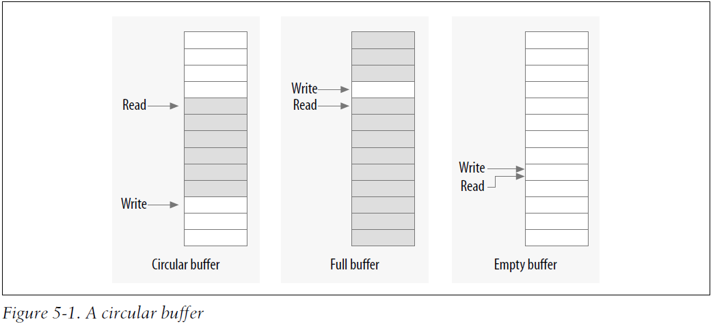

# 并发和竞态

为响应现代硬件和应用程序的要求，Linux 内核已经发展为同时处理更多的事情。这种变革使得内核性能及伸缩性得到了相当大的提高，然而也提高了内核编程的复杂性。

## scull的缺陷 *（Pitfalls in scull）*

深入到 scull 驱动程序的 write 中，会发现 scull 必须判断所请求的内存是否分配好。

```c
if (!dptr->data[s_pos]) {
    dptr->data[s_pos] = kmalloc(quantum, GFP_KERNEL);
    if (!dptr->data[s_pos])
        goto out;
}
```

如果这时有两个进程都在向同一偏移地址写入数据，并且同时到达了 `if语句` 这里。这时如果指向 NULL，这两个进程就都会决定分配内存，而结果就是会向 `dptr->data[s_pos]` 赋值两次，结果就是第二次赋值才能成功，这样就导致第一次分配的内存被忘记，并且不会被释放返回给系统。**这种事件就是竟态（竞争状态，APUE3-8.9），会对共享数据进行非控制访问，发生未知错误。**

## 并发及其管理 *（Concurrency and Its Management）*

在现代 Linux 系统中存在大量的并发来源，这些都会导致竟态。SMP 系统可能会在不同的处理器上同时执行我们的代码。内核代码是可抢占的，因此我们的驱动程序代码会在不确定的时间丢失对 CPU 的独占。设备中断是异步事件，也会导致代码的并发执行。内核中还提供很多可延迟执行代码的机制，多用于中断下半部，比如`worqueue`，`tasklet`，`timer`等，这些机制使得当前进程会被软中断去执行延时的目标代码。

竟态通常作为资源的共享访问结果而产生。当两个执行线程需要访问相同的数据结构，混合的可能性就永远存在。所以应该避免共享资源。但是现实编程中，这个并不好避免，无论是从硬件还是软件上来讲，有时共享是必须的。因此资源共享的**硬规则**：

- 在单个执行线程之外（另一个进程）共享硬件或软件资源的任何时候，因为从另一个线程可能看到的资源是不同步的，因此必须显示的管理资源的访问。常见的技术有**“互斥锁”**——确保一次只有一个进程在对共享的资源进行访问。

## 信号量和互斥体 *（Semaphores and Mutexes）*

　　为了避免竞争共享的资源，我们最好的办法是将对共享资源的操作都变为原子的操作，也就是说涉及到其他线程对该数据操作时，整个操作就已经完成了。为此，需要建立临界区：在任意给定的时刻，代码只能被一个线程执行。例如前面给出的那个内存分配的例子，将对 `if判断之后的代码` 全都放入互斥区中，这样当一个线程进入后，其他线程只能等待（或休眠），这样就不会出现两个进程重复分配内存的问题。

> 关于休眠：在当前操作无法完成，需要等待某种条件时，让出处理器给其他的执行线程，知道将来条件满足并通过内核调度获得处理器使它能够继续完成自己想要进行的操作为止。

- 为了不同的需求临界区也是大不相同的，为此内核提供了许多不同的原语。就像在 scull 的例子中，每个发生在进程上下文的对 scull 的数据结构进行访问的请求都是直接来自用户，没有**中断处理例程**或者其他的**异步上下文**的访问需求。在访问自己的数据结构时 scull **不占有其他的系统资源**。这也就意味着，当 scull 驱动程序在等待访问数据结构而进入休眠时，不需要考虑到其**他的内核组件**。换句话说就是可休眠的。重要的是，我们执行`kmalloc`分配内存操作，这个操作也有可能休眠。因此构建临界区时，我们选择使用的锁定原语必须在其他拥有这个锁并休眠的情况下工作，否则可能造成死锁等问题。并不是所有的锁定机制都可在休眠的情况下工作（有的锁定机制就不能休眠），因此现在最适合的就是**信号量**。

- 一个信号量的本质是一个整数值，它和一对函数联合使用，这一对函数通常称为`P`和`V`。希望介入临界区的进程将在相关信号量上调用`P`；如果信号量的值大于`0`，则该值会减一，而进程可以继续。如果为零（或者更小），进程必须等待直到其他进程释放该信号量。通过 `V` 来释放该信号量。当信号量用于互斥时，信号量的初始值应为 `1`。这种信号量在任何给定的时刻只能有单个进程或者线程拥有。在这种使用模式下，信号量为`1`时也称之互斥体。对信号量增减操作都是原子的，可以看做是一条语句完成，不存在竞争。

### Linux 信号量的实现 *（The Linux Semaphore Implementation）*

- 想要使用号量内核代码要包含头文件书中是在<asm/semaphore.h>，但是该头文件自从`2.6.27`之后已经被移动到 linux/semaphore.h，所以将头文件包含改为 **`#include <linux/semaphore.h>`**。相关的类型是 `struct semaphore`，实际的信号量可通过几种途径来声明和初始化：
- 其中之一就是通过 `sem_init` 直接创建信号量：

```c
void sema_init(struct semaphore *sem, int val);
// val 就是初始值。
```

- 如果用于互斥，内核提供了一组辅助函数和宏简化对信号量的操作:

```c
DECLARE_MUTEX(name);
DECLARE_MUTEX_LOCKED(name);
//第一个宏是将互斥信号量（name）变量初始化为 1。第二个是初始化为 0，这时线程想要访问之前，需要先显式的解锁才可以。
```

- 如果互斥体必须在运行时初始化，应使用下面的函数之一：

```c
void init_MUTEX(struct semaphore *sem);
void init_MUTEX_LOCKED(struct semaphore *sem);
```

- 在 Linux 中，P 函数被称为 down，这里的 down 是指该函数减少了信号量的值：

```c
void down(struct semaphore *sem);
int down_interruptible(struct semaphore *sem);
int down_trylock(struct semaphore *sem);
```

- `down` 减少信号量的值，并且必要时**一直等待**。
  - `down_interruptible` 完成相同的工作，但是操作是可中断的，中断版本使我们经常使用的，他允许等待某个信号量上的用户空间进程可被用户中断。作为规则，我们不应该使用不可中断操作，除非没有其他的可变通方法，非中断操作是建立不可杀进程（ps 中输出 “D state”）的办法。使用可中断的 down_interruptible 操作一旦被中断就会返回非零值，而调用者不会得到该信号量，应该始终检查返回值，并作出响应。
  - 最后的版本 ( `down_trylock`) 永远不会不睡眠， 如果信号量在调用时不可用， down_trylock 立刻返回一个非零值。

- 当一个线程成功调用了 down 的某个版本后，就称为该线程“拥有”了该信号量。当互斥操作完成后，必须返回该信号量。Linux 等价于 V 的函数是 up：

```c
void up(struct semaphore *sem);
//调用 up 之后，调用者不在拥有该信号量。
```

### 在 scull 中使用信号量 *（Using Semaphores in scull）*

在驱动程序中所有的信息都保存在 scull_dev 结构体中，因此该结构体就是应该锁定机构的逻辑范围。

- `scull_dev` 结构定义：

  ```c
  /* sem 就是信号量，对每个虚拟的 scull 设备使用独立的信号量
   * 这样允许不同的设备上的操作可以并行，从而提高性能。
   */
  struct scull_dev {
      struct scull_qset *data; /* Pointer to first quantum set */
      int quantum; /* the current quantum size */
      int qset; /* the current array size */
      unsigned long size; /* amount of data stored here */
      unsigned int access_key; /* used by sculluid and scullpriv */
      struct semaphore sem; /* 互斥信号量 */
      struct cdev cdev; /* Char device structure */
  };

  ```

- 信号量在使用时的初始化：

```c
/*这个for循环每循环一次，完成对一个scull设备的初始化*/
for (i = 0; i < scull_nr_devs; i++) {
    scull_devices[i].quantum = scull_quantum;
    scull_devices[i].qset = scull_qset;
    init_MUTEX(&scull_devices[i].sem); //信号量必须在设备被注册到系统中之前完成初始化，否则会出现竞态。
    scull_setup_cdev(&scull_devices[i], i); //设备注册函数调用之前，我们完成了对信号量的初始化。
}
```

- 检查代码凡是要改变 scull_dev 结构体内容的地方，都必须加锁，防止竞态。例如，在 scull_write 函数中，有如下语句：

```c
if (down_interruptible(&dev->sem))
    return -ERESTARTSYS;
```

- 注意检查返回值，如果返回`非 0 值`，说明操作被**中断**，通常这种情况会返回 `-ERESTARTSYS`，这个返回码要么就是让内核**重新启动该调用**，要么就是返回给用户。无论哪种，在返回之前首先要撤销已经做出的所有用户都可见的修改，如果无法撤销则应该返回`-EINTR`。

- 在执行完后都应该释放该信号，并且返回调用的状态码。在执行整个 write 操作中会有许都可能出错的地方，这些出错都会 goto 到 out 来完成清除工作：

```c
out:
    up(&dev->sem);
    return retval;
```

### 读取者/写入者信号量*（Reader/Writer Semaphores）*

- 对于互斥量的操作也可以进行细分，对于不同的操作可以进行相应的调整来优化，比如只进行读取操作，那么完全可以让多个任务同时进行，因为这些操作没有对数据做出修改，大大的提高效率。Linux 对于这种情况提供了一种特殊的信号量，称为 "rwsem" (or“reader/writer semaphore”)，虽说驱动程序中使用的机会相对较少，但是偶尔也很有用。
- 首先的包含该信号量的头文件 <linux/rwsem.h>。`rwsem` 的相关数据结构是 `struct rw_semaphore`。一个 rwsem 对象必须在运行时通过下列函数来进行初始化：

```c
void init_rwsem(struct rw_semaphore *sem);
```

- 对于只读访问，可用的接口如下：

```c
void down_read(struct rw_semaphore *sem);
int down_read_trylock(struct rw_semaphore *sem);
void up_read(struct rw_semaphore *sem);
```

- 对 `down_read` 的调用提供了对受保护资源的只读访问，可和其他的读取这并行访问。但是 down_read 可能将调用进程置于**不可中断**的休眠中。
  - `down_read_trylock` **不会**再读取访问时**等待**；被拒绝访问时返回**非 0（注意）**，其他情况下 0。
  - 由 down_read 获得的 rwsem 对象最终必须通过 up_read 被释放。

- 针对写入者的接口：

```c
void down_write(struct rw_semaphore *sem);
int down_write_trylock(struct rw_semaphore *sem);
void up_write(struct rw_semaphore *sem);
void downgrade_write(struct rw_semaphore *sem);
```

- `down_write`、`down_write_trylock` 和 `up_write` 与读取者的对应函数行为相同。
- 当某个快速改变获得了写入者锁，而其后是更长时间的只读访问的话，我们可以结束修改之后调用`downgrade_write`，来允许其他读取者的访问。

- 一个`rwsem`信号允许**一个写入者**和**多个读取者**，写入者拥有更高的权限，因此如果有大量的写入者就会导致读取者“饿死”。为此，最好在**很少需要写入访问**且写入只会拥有短息的信号量的时候使用rwsem。

## completion *（completion）*

驱动开发中，有时我们需要在当前线程 (A) 之外创建另外一个线程 (B) 执行某个活动，然后线程 (A) 等待该活动结束，待活动结束后，线程 (A) 再继续向下执行，可以使用完成变量（completion variable）来完成**任务间同步**。

- 使用信号量也能实现同步，但信号量并不适合。因为在通常的使用中，如果试图锁定某个信号量，一般来说，都能加锁成功。如果存在对信号量的严重竞争，性能将受很大影响。这时，我们就需要检查一下我们的加锁操作设计是不是有问题了。信号量对“可用”情况已经做了大量优化。对于上面所说的情况，如果用信号量实现同步，则加锁的线程几乎总是要等待，造成系统性能下降。
- `completion`是一种轻量级的机制，它允许一个线程告诉另外一个线程某个工作已经完成，使用该接口的头文件<linux/completion.h>。创建Com接口使用:

```c
DECLARE_COMPLETION(my_completion);
```

- 如果 必须动态创建和初始化 completion 使用如下方法 :

```c
struct completion my_completion;
/* ... */
init_completion(&my_completion);
```

- 等待completion使用如下函数：

```c
 void wait_for_completion(struct completion *c);
```

- 相应的，completion事件可以通过如下函数触发：

```c
 void complete(struct completion *c);
 void complete_all(struct completion *c);
//第一个会唤醒一个等待的线程，而all会唤醒所有等待的线程。
```

一个completion设备通常是一次设备，也就是执行一次后被丢弃，但是仔细处理也可以重复利用，但是不能使用`complete_all`来触发，如果使用了`all`则必须在重复使用该结构之前重新初始化它，初始化：

```c
INIT_COMPLETION(struct completion c);
```

使用方法实例：

```c
DECLARE_COMPLETION(comp);
ssize_t complete_read (struct file *filp, char __user *buf, size_t count, loff_t *pos)
{
    printk(KERN_DEBUG "process %i (%s) going to sleep\n",current->pid, current->comm);
    wait_for_completion(&comp);
    printk(KERN_DEBUG "awoken %i (%s)\n", current->pid, current->comm);
    return 0; /* EOF */
}

ssize_t complete_write (struct file *filp, const char __user *buf, size_t count, loff_t *pos)
{
    printk(KERN_DEBUG "process %i (%s) awakening the readers...\n", current->pid, current->comm);
    complete(&comp);
    return count; /* succeed, to avoid retrial */
}
```

## 自旋锁 *（Spinlocks）*

大多数锁定通过称为**"自旋锁"**的机制实现。和信号量不同，自旋锁`可在`**不能休眠**的代码中使用，比如中断处理程序。正确使用会提供比信号量更高的性能。

一个自旋锁是一个互斥设备，他只能有两种状态：锁定和解锁。在多进程中，第一个执行的进程会锁定自旋锁，然后后面的进程就不能获得锁，则代码进入**忙循环并重复检查这个锁**，直到可用为止。这就是自旋部分。**"测试并设置锁"**的这一步必须是`原子`操作方式完成，这样即使有多个线程在等待锁，也只有一个线程可以获得锁。自旋锁主要是为了在多处理器系统上使用。但是在单处理器系统上运行可抢占内核时行为就像SWP。如果是非抢占式的但处理器，一旦进入到某个锁上的自旋状态，就会一直自旋下去，不会有其他的线程能够占用CPU释放这个锁。因此，在单处理器中自旋锁被优化成什么也不做。

### 自旋锁API *（Introduction to the Spinlock API）*

自旋锁 API 所需要的头文件`<linux/spinlock.h>`。实际的锁具有`spinlock_t`类型。首先自旋锁必须初始化：

```c
spinlock_t my_lock = SPIN_LOCK_UNLOCKED;
```

或者在运行时，调用：

```c
void spin_lock_init(spinlock_t *lock);
```

进入临界区之前，获取锁的调用：

```c
void spin_lock(spinlock_t *lock);
```

所有的自旋锁等待在本质上是不可中断的。一旦自旋lock后，其他的进程在获得锁之前一直处于自旋。

释放锁：

```c
void spin_unlock(spinlock_t *lock);
```

### 自旋锁和原子上下文 *（Spinlocks and Atomic Context）*

假定当我们的驱动程序获得了一个自旋锁的锁后，进入临界区开始工作后，调用了一个可导致睡眠的操作，或者被等级更高的进程抢了 CPU 的执行权，这样我们的代码拥有了这个自旋锁但是却休眠，它不会释放，并且后面的操作也就都在自旋等待，最好的情况是，该线程等待了一阵又回来开始处理，最坏的情况便是整个系统进入了死锁。

- 因此规则是：任何拥有自旋锁的代码必须是原子操作。他不能休眠，事实上，他不能因为任何原因失去对 CPU 的占有，除了服务中断以外。

当内核代码拥有自旋锁后，在相关处理器上的抢占就会被禁止。甚至在单处理器系统上，也必须以同样的方式禁止抢占。在拥有锁的时候尽量避免休眠，虽然有许多操作都是会休眠的，当我们编写自旋锁的临界区时，必须注意每一个所调用的函数。另一种情况：驱动正在执行，并且已经获得锁，这个锁控制着对设备的访问。在拥有这个锁的时候，设备产生一个中断。而中断处理函数在处理时也需要获得这个锁。就导致死锁，中断处理一直在自旋，而临界区却无法释放锁。这也是不能休眠的一个原因。为了避免这种情况，需要在拥有自旋锁时禁止中断（仅在本地CPU）。

- 另一个规则：自旋锁必须在可能的最短时间内拥有。自旋锁占有时间越长那么其他处理器自旋等待的时间越长，整个内核的延时就会大大增加，死锁的可能性也会增加。

### 自旋函数 *（The Spinlock Functions）*

- 自旋锁的锁定函数：

```c
void spin_lock(spinlock_t *lock);
void spin_lock_irqsave(spinlock_t *lock, unsigned long flags);
void spin_lock_irq(spinlock_t *lock);
void spin_lock_bh(spinlock_t *lock);
```

1. `spin_lock_irqsave` 会在获得自旋锁之前禁止中断（仅在当前CPU上），而先前的中断状态保存在 `flags` 中。
2. 如果确定没有其他的本地代码禁止了中断则可以使用 `spin_lock_irq`，无需跟踪标志。在释放自旋锁后会自动启动中断。
3. 最后 `spin_lock_bh` 在获得锁之前禁止软件中断，会让硬件中断保持打开。

- 注意：自旋锁可以被中断（硬或软中断）上下文中的代码获得，则必须使用某个禁止中断的 `spin_lock` 形式，如果不禁止中断很容易导致系统死锁。如果仅仅被软中断中使用，则可以使用 `spin_lock_bh`这样既可以屏蔽软中断，又可以服务硬件中断。

- 释放锁的方法：

```c
void spin_unlock(spinlock_t *lock);
void spin_unlock_irqrestore(spinlock_t *lock, unsigned long flags);
void spin_unlock_irq(spinlock_t *lock);
void spin_unlock_bh(spinlock_t *lock);
```

- 每个 `spin_unlock` 变种都会撤销对应的 `spin_lock` 函数所做的工作。传递到 `spin_unlock_irqrestore` 的 `flags` 的参数必须是传递到 `spin_lock_irqsave` 同一个变量。并且要在同一个函数中调用这两个操作中断的自旋锁。

- 非阻塞的自旋锁：

```c
int spin_trylock(spinlock_t *lock);
int spin_trylock_bh(spinlock_t *lock);
```

- 这两个函数在成功的情况下返回非零值，否则返回零。对于禁止中断没有`try`版本。

### 读取者/写入者自旋锁 *（Reader/Writer Spinlocks）*

这种自旋锁与之前的读 /写很相似。允许任意数量的读取者进入临界区，但是写入这必须互斥访问。

- 数据类型是`rwlock_t`，在`<linux/spinlokc.h>`中定义。声明和初始化的方法：

```c
rwlock_t my_rwlock = RW_LOCK_UNLOCKED; /* Static way */

rwlock_t my_rwlock;
rwlock_init(&my_rwlock); /* Dynamic way */
```

- 读取者可用的函数：

```c
void read_lock(rwlock_t *lock);
void read_lock_irqsave(rwlock_t *lock, unsigned long flags);
void read_lock_irq(rwlock_t *lock);
void read_lock_bh(rwlock_t *lock);

void read_unlock(rwlock_t *lock);
void read_unlock_irqrestore(rwlock_t *lock, unsigned long flags);
void read_unlock_irq(rwlock_t *lock);
void read_unlock_bh(rwlock_t *lock);
```

- 写的函数是类似的：

```c
void write_lock(rwlock_t *lock);
void write_lock_irqsave(rwlock_t *lock, unsigned long flags);
void write_lock_irq(rwlock_t *lock);
void write_lock_bh(rwlock_t *lock);
int write_trylock(rwlock_t *lock);

void write_unlock(rwlock_t *lock);
void write_unlock_irqrestore(rwlock_t *lock, unsigned long flags);
void write_unlock_irq(rwlock_t *lock);
void write_unlock_bh(rwlock_t *lock);
```

**注意**：和 rwsem 相似，这种锁可能造成读取者饥饿。如果对锁的竞争导致饥饿，性能就会降低。

## 锁陷阱 *（Locking Traps）*

### 不明确的规则 *（Ambiguous Rules）*

- 恰当的锁定模式需要清晰和明确的规则。
  - 规则一：每当一个需要被并行访问的对象时，应该同时设计好对他的锁定模式。
  - 规则二：无论是自旋锁还是信号量都**不允许`锁拥有者`第二次获得这个锁**，如果这么做的话，那么系统就会被挂起。
  - 规则三：内部静态函数可以假定在调用前已经获取到了相关的锁，但是如果提供给外部调用的函数必须显示的处理锁定。
    - 在 scull 的例子中：由系统调用直接调用的那些函数均要获得信号量，以便保护要访问的设备。而其他的**内部函数**都只会由**其他的 scull 函数**（系统调用等）调用，则假设信号量已经正确获得。

### 锁的顺序规则 *（Lock Ordering Rules）*

- 使用大量锁的系统中，代码通常需要一次拥有多个锁，但是拥有多个锁是非常危险的，他们可能造成死锁。
  - 想要解决的办法通常是：在必须获得多个锁得时候，应该始终以相同的顺序获得。只要代码整体按照这条规则，就可以避免多锁造成互相加锁情况。（APUE3。11.6.2）
  - 其他规则：
      1. 如果需要获得一个局部锁，以及一个位于内核更中心位置的锁，则应该先获取自己的局部锁；
      2. 如果我们有信号量和自旋锁的组合，必须先获得信号量；
      3. 在拥有自旋锁时调用`down`(可导致休眠)是个严重的错误。

### 细粒度锁和粗粒度锁对比 *（Fine- Versus Coarse-Grained Locking）*

　　最早支持多处理器的系统是`Linux2.0`，它包含了一个超级大的锁，直接将整个内核全部拖入锁定的空间，这样只有一个 CPU 可以进入内核执行，解决并发问题，但是这样其他的 CPU 全部在等待这个锁上花费了大量的时间，双内核还没有两台电脑快。因此细粒度的锁诞生了，他在内核每个资源上都有一个细粒度的锁来保护。这样每个处理器在执行特定任务时就不需要和其他任务的处理器使用的锁进行竞争。
　　然而，细粒度锁也是有他自己的问题，因为内核包含了数千个锁，为了执行某个特定的操作，我们很难确定哪个锁，并且如何去安全的获取。细粒度锁将会带来复杂性，以及难维护的问题。驱动中的锁相对比较直接，可以使用粗粒度锁处理所有驱动所做的事情，也可以为自己管理的每个设备建立一个锁。通常情况下，应该在最初使用粗粒度锁，除非能确定这么做有相当大的影响才放弃。也可以使用lockmeter工具检测内核在锁上花费的时间。([Kernel Spinlock Metering for Linux](http://oss.sgi.com/projects/lockmeter/))

## 除了锁以外的办法 *（Alternatives to Locking）*

### 免锁算法 *（Lock-Free Algorithms）*



### 原子变量 *（Atomic Variables）*

有时共享的资源仅仅是一个整形变量，那么在进行一些简单的操作：`n_op++；`这样也需要锁定，虽然有的处理器对于这样的处理是原子的，但是我们不能总是这么期望。但是为这么一个简单的操作来实现一套完整的锁机制，实在是浪费，因此，内核提供了一种原子整数类型，`atomic_t`，定义在 `<asm/atomic.h>`。

一个`atomic_t`变量在所有内核支持的架构上保存一个 `int` 值，但是由于某些处理器上的工作方式限制，在 `atomic_t` 变量中不能记录大于`24位`的整数。下面的操作已经确定在SMP计算机的所有处理器上都是原子的，这种操作速度很快，因为只要有可能，他们就会被编译成单个指令。

- 将原子变量 `v` 设置为整数值 `i` ， 也可在编译时使用宏定义 `ATOMIC_INIT` 初始化原子值。

```c
void atomic_set(atomic_t *v, int i);
atomic_t v = ATOMIC_INIT(0);
```

- `read` 返回 v 的当前值。`add` 则是由 v 指向的原子变量加 i，返回值是 void，因为返回新值会有额外的开销，并且大部分时间不需要知道累加后的值。

```c
int atomic_read(atomic_t *v);
void atomic_add(int i, atomic_t *v);
```

- 从 *v 减去 i.

```c
void atomic_sub(int i, atomic_t *v);
```

- 递增或递减一个原子变量.

```c
void atomic_inc(atomic_t *v);
void atomic_dec(atomic_t *v);
```

- 执行特定的操作并且测试结果; 如果, 在操作后, 原子值是 0, 那么返回值是真; 否则, 它是假. 注意没有 atomic_add_and_test函数。

```c
int atomic_inc_and_test(atomic_t *v);
int atomic_dec_and_test(atomic_t *v);
int atomic_sub_and_test(int i, atomic_t *v);
```

- 将整数变量 i 加到 v上，如果结果是负值返回值是真, 否则为假.

```c
int atomic_add_negative(int i, atomic_t *v);
```

- 类似 atomic_add 和其变种函数，特点是它们返回原子变量的新值给调用者。

```c
int atomic_add_return(int i, atomic_t *v);
int atomic_sub_return(int i, atomic_t *v);
int atomic_inc_return(atomic_t *v);
int atomic_dec_return(atomic_t *v);
```

**注意：**`atomic_t`数据项必须通过上述的函数访问。如果将原子变量传递给需要整形参数的函数，就会报错。`atomic_t` 值只在当只有一个原子变量的情况下才能工作。 需要多个 `atomic_t`变量的操作仍然需要其他种类的加锁。

- 考虑一下下面的代码：

```c
atomic_sub(amount, &first_atomic);
atomic_add(amount, &second_atomic);
```

从第一个原子值中减去 amount，到还没有加到第二个时, 存在一段时间。在这个窗口时间中运行的其他代码可能会导致问题发生。

### 位操作 *（Bit Operations）*

内核提供了一组用来原子修改和测试 `单个位`的函数。因为整个操作发生在单个步骤中，因此，不会受到中断或其他因素的干扰。原子位操作非常快，仅仅编译成一条指令，且不需要禁止中断。这些函数依赖于架构定义在`<asm/bitops.h>`中，不幸的是，函数使用的数据类型也是依赖于具体架构的。`nr` 参数(描述要操作哪个位)常常定义为 `int`, 但是在几个体系中是 `unsigned long`。要修改的地址常常是一个 `unsigned long`指针, 但是个别体系使用 `void *`代替。

- 设置在 addr 指向的数据项中第 nr 位。

```c
void set_bit(nr, void *addr);
```

- 清除 addr 指向的数据项第 nr 位，它的语义与 set_bit 的相反.

```c
void clear_bit(nr, void *addr);
```

- 翻转这个位.

```c
void change_bit(nr, void *addr);
```

- 这个函数是唯一一个不需要是原子的位操作; 它简单地返回这个位的当前值.

```c
test_bit(nr, void *addr);
```

- 原子地动作如同前面列出的， 除了它们还返回这个位以前的值。

```c
int test_and_set_bit(nr, void *addr);
int test_and_clear_bit(nr, void *addr);
int test_and_change_bit(nr, void *addr);
```

另一种用处，就是使用位操作来管理一个锁变量，控制对某个共享变量的访问、可使用 `test_and_set_bit` 或者 `test_and_clear_bit` 。常见的方法如下，假定锁就是 addr 地址上的第 nr 位。它还假定当锁在零时空闲，而在非零时繁忙。

```c
/* try to set lock */
while (test_and_set_bit(nr, addr) != 0)
    wait_for_a_while();

/* do your work */

/* release lock, and check... */
if (test_and_clear_bit(nr, addr) == 0)
    something_went_wrong(); /* already released: error */
```

### seqlocks *（seqlocks）*

Linux 2.6内核包含了两个新的机制，可提供对共享资源的快速、免锁访问。当要保护的资源很小、很简单，并且会被频繁访问，**很少发生写入**操作且**写入量比较少**的情况就可以使用 `seqlock`。它允许所有的读取者读取数据，但是会检查是否与写入冲突，会自动重试读取。 **但是他不能保护含有指针的数据结构**。

- seqlock 在 `<linux/seqlock.h>` 中定义。通常用于初始化`seqlock`（`seqlock_t`类型）的方法：

```c
seqlock_t lock1 = SEQLOCK_UNLOCKED;

seqlock_t lock2;
seqlock_init(&lock2);
```

- 读取访问通过获得一个（无符号）整数顺序值而进入临界区。在退出时，该顺序值会和当前值比较；如果不相等，则必须重新试图访问。读取者代码：

```c
unsigned int seq;

do {
    seq = read_seqbegin(&the_lock);
    /* Do what you need to do */
} while read_seqretry(&the_lock, seq);
```

- 如果在中断处理程序中使用seqlock，则应该使用`IRQ安全版本`：

```c
unsigned int read_seqbegin_irqsave(seqlock_t *lock, unsigned long flags);
int read_seqretry_irqrestore(seqlock_t *lock, unsigned int seq, unsigned long flags);
```

- 写入者必须在进入有seqlock保护的临界区时获取一个互斥锁,，写入锁使用自旋锁实现，因此自旋锁的常见限制也适用于写入锁。

```c
void write_seqlock(seqlock_t *lock);
```

- 释放：

```c
void write_sequnlock(seqlock_t *lock);
```

- 因为自旋锁用来控制写存取, 所有通常的变体都可用:

```c
void write_seqlock_irqsave(seqlock_t *lock, unsigned long flags);
void write_seqlock_irq(seqlock_t *lock);
void write_seqlock_bh(seqlock_t *lock);
void write_sequnlock_irqrestore(seqlock_t *lock, unsigned long flags);
void write_sequnlock_irq(seqlock_t *lock);
void write_sequnlock_bh(seqlock_t *lock);
```

如果 `write_tryseqlock` 可以获得自旋锁，他也会返回非零值。

### 读取--复制--更新 *（Read-Copy-Update）*

略过~~

## 互斥体与自旋锁的抉择

互斥体的实现依赖于自旋锁，互斥体是进程级的，用于多个进程之间对资源的互斥，虽然也实现在内核中，但是该内核执行路径是以进程的身份，代表进程来争夺资源的。如果竞争失败，会发生进程上下文切换，当前路径进入睡眠状态，CPU 将运行其他进程。鉴于进程上下文切换的开销也很大，因此，只有当进程占用的资源时间较长时，互斥体是很好的选择。

- 当所要保护的临界区访问时间较短时，使用自旋锁时非常方便的，因为它可节省上下文切换的时间，但是 CPU 得不到自旋锁会在那里空转直到其他执行单元解锁为止，影响系统的响应速度。下面是详细规则：
    1. 当锁不能被获取时，使用互斥体的开销是进程上下文切换的时间，使用自旋锁的是等待获取自旋锁（有临界区大小决定）
    2. 互斥体所保护的临界区可包含可能引起阻塞的代码，而自旋锁要避免。因为阻塞代表要进程切换，如果进程切换出去，另一个进程企图获取本自旋锁，死锁就会发生。
    3. 互斥体存在于进程上下文，因此，如果被保护的共享资源需要在中断或软中断情况下使用，则在互斥体和自旋锁之间只能选择自旋锁。
