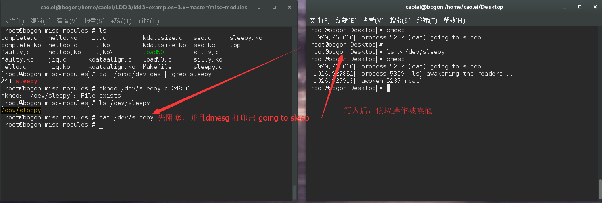
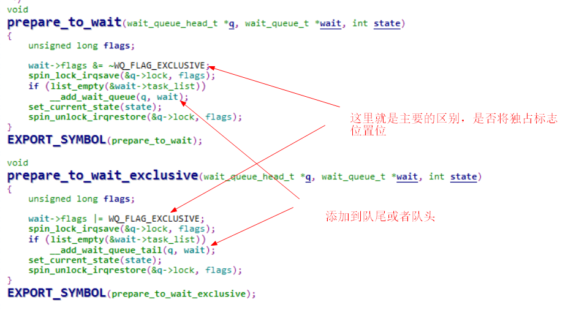
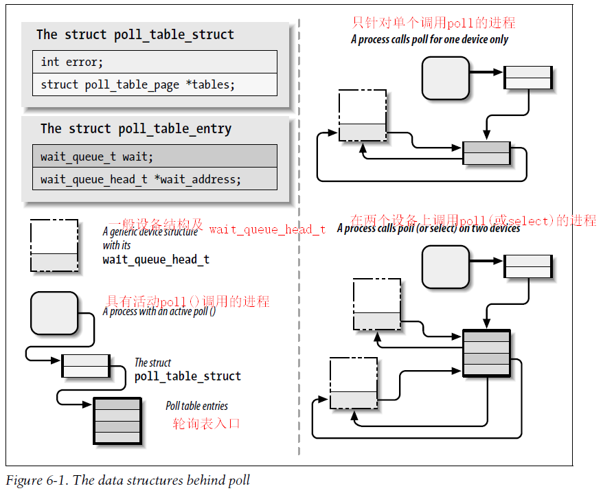

# 高级字符驱动程序操作

本章阐述了编写全功能字符设备驱动程序的几个概念：

- 首先，实现 ioctl 系统调用，它是用于设备控制的公共接口。
- 然后，介绍了和用户空间的保持同步的几种方法。包括，如何使进程休眠（唤醒）、非阻塞I/O、以及在设备写入和读取时如何通知用户空间。

## ioctl接口 *（ioctl）*

除了读写设备之外，驱动程序大部分还需要执行**各种类型**的对硬件操作，比如更改波特率之类的。这些都是通过 ioctl 支持的，该方法实现了同名的系统调用。

- 在用户空间，ioctl的原型：

```c
int ioctl(int fd, unsigned long cmd, ...);
```

通常 `...` 表示可变数目的参数表。但在实际使用中，它是必须具有精确定义的原型，他仅仅是一个可选参数，习惯使用`char *argp`定义，使用点是为了防止编译器的类型检查，这个参数的有无和 `cmd` 的意义相关。可以不传参数，也有可能需要传递一个整形参数，而某些则需要传递一个指针参数。

- 驱动程序的 ioctl 方法原型：
  - `inode` 和 `filp` 指针是对应应用程序传递的文件描述符 `fd` ，这和传递给 open 方法的参数相同。
  - `cmd` 参数从用户那里不经修改地传到驱动中 , 并且可选的参数 `arg` 参数不管它是否由用户给定为一个整数或一个指针， 总是以一个 `unsigned long` 的形式传递。
  - 如果调用程序没有传递第3个参数，那么驱动程序中的 arg 就是未定义的。

```c
int (*ioctl) (struct inode *inode, struct file *filp, unsigned int cmd, unsigned long arg);
```

大部分 ioctl 实现使用 `switch` 语句来根据 `cmd` 参数选择相应的操作，不同的命令被赋予不同的数值，为了简化编码，在代码中这些数值通常被表示为符号名， 符号名通过 C 语言预处理语句来定义。定制的驱动常常声明这样的符号在它们的头文件中，`scull.h` 中就包含 scull 关于编码的声明。 为了使用这些符号名，用户程序也需要包含 `.h文件`。

### 选择 ioctl 命令 *（Choosing the ioctl Commands）*

在驱动程序中实现的 ioctl 函数体内，实际上是有一个`switch{case}`结构，每一个`case`对应一个**命令码**，做出一些相应的操作。因为设备都是特定的。关键在于**怎样组织命令码**，因为在 ioctl 中命令码是**唯一联系**用户程序命令和驱动程序支持的途径。命令码的组织是有一些讲究的，因为我们一定要做到命令和设备是一 一对应的，这样才不会将正确的命令发给错误的设备，或者是把错误的命令发给正确的设备，或者是把错误的命令发给错误的设备。这些错误都会导致不可预料的事情发生，而当程序员发现了这些奇怪的事情的时候，再来调试程序查找错误，那将是非常困难的事情。

- 所以在  Linux 核心中是这样定义一个命令码的：
    1. **设备类型--`type`：**：幻数，选择一个号码，并且在整个驱动中使用这一个号。"幻数"是一个字母，数据长度也是8，用一个特定的字母来标明设备类型，这和用一个数字是一样的，只是更加利于记忆和理解。
    2. **number**：序列号。
    3. **direction**：方向，如果相关命令涉及到数据的传输 ，则该位字段定义数据传输的方向。可以使用值包括`_IOC_NONE`(没有数据传输) , `_IOC_READ` ,`_IOC_WRITE`和`_IOC_READ | _IOC_WRITE`(双向传输)。
    4. **size**：用户数据的大小。系统并不强制使用这个字段，内核不会检查。但是对该字段的正确使用可帮助我们检测用户空间程序的错误，并且如果不改变相关数据项的大小的话，这个字段还可以帮助我们实现向后兼容。

>______________________________________
>| 设备类型 | 序列号 | 方向 | 数据尺寸   |
>| 8 bit   | 8 bit | 2 bit | 8~14 bit  |
>|_____________________________________|

- `<linux/ioctl.h>`中包含的`<asm/ioctl.h>`头文件中定义了一些构造命令编号的宏：

```c
_IO(type,nr)           //用于构造无参数的命令编号；
_IOR(type,nr,size)    //用于构造从驱动程序中读取数据的命令编号；
_IOW(type,nr,size)   //用于写入数据的命令；
_IOWR(type,nr,size) //用于双向传输。
```

- 相对的，Linux内核也提供了相应的宏来从 ioctl 命令号中解码相应的域值：

```c
_IOC_DIR(nr)
_IOC_TYPE(nr)
_IOC_NR(nr)
_IOC_SIZE(nr)
```

### 返回值 *（The Return Value）*

ioctl 的实现常常是一个基于命令号的 switch 语句，但是当命令号没有匹配一个有效的操作时，默认的选择应当是什么? 这个问题是有争议的。

1. 有一些内核函数返回 `-ENIVAL`("Invalid argument"), 它有意义是因为命令参数确实不是一个有效的。
2. POSIX 标准规定如果使用了一个不合适的 ioctl 命令， 那么应当返回`-ENOTTY`， 这个错误码被 C 库解释为"不适当的设备的 ioctl", 这常常正是程序员需要听到的。

然而, 对于响应一个无效的 ioctl 命令，返回 -EINVAL仍然是相当普遍的。

### 预定义命令 *(The Predefined Commands)*

虽然 ioctl 系统调用的大部分用于操作设备，但是还有一些命令时可以由内核识别的，并且这些命令在我们自己的文件操作调用之前被解码使用，所以要注意不要将自己的 ioctl 命令与内核预定义的命令冲突。

- 预定义命令分为 3 类:
  - 可用于任何文件的(常规, 设备, FIFO, 或者 socket) 的命令
  - 只对常规文件使用的命令.
  - 特定于对文件系统类型的命令.

- 内核中还预定义了一些I/O控制命令，如果某设备驱动中包含了与预定义命令一样的命令码，这些命令会被当做预定义命令被内核处理而不是被设备驱动处理，有如下4种:
    1. **FIOCLEX** : 即 file ioctl close on exec 对文件设置专用的标志，通知内核当exec()系统带哦用发生时自动关闭打开的文件
    2. **FIONCLEX** : 即 file ioctl not close on exec，清除由 FIOCLEX 设置的标志
    3. **FIOQSIZE** : 获得一个文件或目录的大小，当用于设备文件时，返回一个ENOTTY错误
    4. **FIONBIO** : 即 file ioctl non-blocking I/O 这个调用修改 flip->f_flags 中的 O_NONBLOCK 标志，常用修改这个标志使用的是`fcntl`系统调用的`F_SETFL`命令完成

```c
//mycmd.h

#include <asm/ioctl.h>
#define CMDT 'A'
#define KARG_SIZE 36
struct karg{
    int kval;
    char kbuf[KARG_SIZE];
};
#define CMD_OFF _IO(CMDT,0)
#define CMD_ON  _IO(CMDT,1)
#define CMD_R  _IOR(CMDT,2,struct karg)
#define CMD_W  _IOW(CMDT,3,struct karg)
...
//chrdev.c
static long demo_ioctl(struct inode * inode, struct file *filp, unsigned int cmd, unsigned long arg)
{
    static struct karg karg = {
        .kval = 0,
        .kbuf = {0},
    };
    struct karg *usr_arg;

    switch(cmd){
    case CMD_ON:
        /* 开灯 */break;
    case CMD_OFF:
        /* 关灯 */break;
    case CMD_R:
        if(_IOC_SIZE(cmd) != sizeof(karg)){
            return -EINVAL;
        }
        usr_arg = (struct karg *)arg;
        if(copy_to_user(usr_arg, &karg, sizeof(karg))){
            return -EAGAIN;
        }
        break;
    case CMD_W:
        if(_IOC_SIZE(cmd) != sizeof(karg)){
            return -EINVAL;
        }
        usr_arg = (struct karg *)arg;
        if(copy_from_user(&karg, usr_arg, sizeof(karg))){
            return -EAGAIN;
        }
        break;
    default:
        ;
    };
    return 0;
}
```

### 使用 ioctl 参数 *(Using the ioctl Argument)*

在使用 ioctl 之前，如果附加参数是整数，那么直接使用即可。但是如果附加参数是一个指针，则必须注意这个指向用户空间的指针必须是合法的，对于未验证的用户空间访问指针可能会发生各种问题。因此我们必须对这些用户空间的指针进行检查，保证他们的正确性。

- `copy_from_user` 和 `copy_to_user` 函数，它们可用来安全地与用户空间交换数据，因此在 ioctl 中可以使用，但是一般 ioctl 只进行较小的数据项交换，因此还有另一种更高效的方法。

- 首先，一个验证地址的方法 `access_ok` 验证地址，`<asm/uaccess.h>`中声明：
  - 第一个参数应当是 `VERIFY_READ` 或者 `VERIFY_WRITE`，addr 参数是一个用户空间地址，size 是一个字节量。例如，如果 ioctl 需要从用户空间读一个整数, size 是 sizeof(int)。如果既要读，又要写，应该设置为 `VERIFY_WRITE`。
  - access_ok 返回一个 bool 值。如果它返回假，驱动应当返回 -EFAULT 给调用者。
  - 关于的两点注意：
        1. 它没有完成校验内存存取的全部工作，只是检查了内存是否位于进程有对应访问权限的区域内，特别是防止指向内核空间的内存区。
        2. 大多数驱动程序代码中不需要真正的调用 access_ok，因为后面讲的内存管理程序中会处理它。

```c
int access_ok(int type, const void *addr, unsigned long size);
```

- scull 示例源码：

```c
int err = 0, tmp;
int retval = 0;
/*
* extract the type and number bitfields, and don't decode
* wrong cmds: return ENOTTY (inappropriate ioctl) before access_ok()
* 抽取类型和编号位字段，并拒绝错误的命令号
* 在调用 access_ok() 之前返回 ENOTTY(不恰当的 ioctl)
*/
if (_IOC_TYPE(cmd) != SCULL_IOC_MAGIC)
        return -ENOTTY;
if (_IOC_NR(cmd) > SCULL_IOC_MAXNR)
        return -ENOTTY;
/*
* the direction is a bitmask, and VERIFY_WRITE catches R/W
* transfers. `Type' is user-oriented, while
* access_ok is kernel-oriented, so the concept of "read" and
* "write" is reversed
*  方向是一个位掩码，而 VERIFY_WRITE 用于 R/W 传输
* “类型”是针对用户空间而言的，而access_ok 是面向内核的
* 因此 "read" and "write" 是相反的
*/
if (_IOC_DIR(cmd) & _IOC_READ)
        err = !access_ok(VERIFY_WRITE, (void __user *)arg, _IOC_SIZE(cmd));
else if (_IOC_DIR(cmd) & _IOC_WRITE)
        err = !access_ok(VERIFY_READ, (void __user *)arg, _IOC_SIZE(cmd));
if (err)
        return -EFAULT;
```

- 在调用 access_ok 之后，驱动就可以安全的进行数据传输了，下面就是一组新的传输数据的函数，这些函数对小的数据(1, 2, 4, 和 8 字节)进行专门优化。
  - 如果试图使用上面列出的函数传递大小不符合任意一个特定值的数值，结果通常是编译器会给出一条奇怪的消息， 例如"coversion to non-scalar type requested". 在这些情况中, 必须使用 copy_to_user 或者 copy_from_user。

```c
put_user(datum, ptr)         // 会进行类型检查 会调用 access_ok 成功返回0
_ _put_user(datum, ptr)     // 不会检查 ，因此需要手动调用 access_ok之后可以使用

get_user(local, ptr)
_ _get_user(local, ptr)
```

### 权能和受限操作 *(Capabilities and Restricted Operations)*

　　对设备的访问由设备文件的权能限制，驱动程序通常不进行权限检查。不过也有这种情况，允许用户对设备读/写，而其他操作被禁止。相对于超级用户和普通用户的权限差距，Linux 内核提供了一个更加灵活的系统, 称为**权能（capability）**。它将特权操作划分为独立的组，这样某个特定的用户或程序就可以被授权执行某一指定的特权操作。`capget` 和 `capset` 系统调用，来管理权能。`<linux/capability.h>`中定义了特权标志。


- 在执行特权操作之前，设备驱动应该验证调用进程是否有特权权限，通过 capable 函数来进行的:

```c
int capable(int capability);
```

- 在 scull 中任何用户被允许查询信息，但是只有授权进程可以修改。ioctl 的 scull 实现检查用户的特权级别, 如下:

```c
    if (! capable (CAP_SYS_ADMIN))
    return -EPERM;
```

- 缺乏一个更加特定的能力时，`CAP_SYS_ADMIN`被选择来做这个测试.

## 阻塞型I/O *(Blocking I/O)*

### 休眠的简单介绍 *(Introduction to Sleeping)*

当一个进程被置入休眠时，他就会被标记为一种特殊状态并从调度器的运行队列中移走。直到某些情况下修改了这个状态，进程才会在任意 CPU 上调度，即运行该进程。休眠中的进程会被搁置在一边，等待将来的某个事件发生。

- 对于 Linux 来说进入休眠很容易。但是，为了安全的使一个进程进入休眠状态，应该注意两条规则。
    1. 永远不要在原子上下文中进入休眠。
    2. 当进程被唤醒，我们无法知道休眠了多长时间，或者休眠期间发生了什么。这样我们在被唤醒之后的状态不能进行假设，因此必须检查并且确定我们等待的条件为真。

>需要注意的：我们必须知道有人会叫醒我们才能进行休眠。完成唤醒任务的代码必须能够找到我们的进程。为了确保唤醒的发生，需整体的了解代码，并清除对于每个休眠而言那些事件会结束休眠。为了能过找到休眠的进程意味着，需要维护一个称为等待队列的数据结构。

- 在Linux中，一个等待队列通过一个**等待队列头（wait queue head）**来管理，等待队列头是一个类型为`wait_queue_head_t`的结构体，定义在 `<linux/wait.h>`。静态定义并初始化一个等待队列：

```c
DECLARE_WAIT_QUEUE_HEAD(name);
```

- 动态申请并初始化一个等待队列：

```c
wait_queue_head_t my_queue;
init_waitqueue_head(&my_queue);
```

### 简单唤醒 *(Simple Sleeping)*

当进程休眠时，他将期待某个条件未来成真。Linux中休眠的方式是`wait_event`宏以及一些变种：

```c
wait_event(queue, condition);
wait_event_interruptible(queue, condition);
wait_event_timeout(queue, condition, timeout);
wait_event_interruptible_timeout(queue, condition, timeout);
```

当进程在休眠的的同时，它会检查进程等待的条件。其中`queue`是等待队列头。注意，它通过**值**传递，而不是通过指针。`condition` 是任意一个**布尔**表达式，上面的宏在休眠前后都要对该表达式求值，在条件为真之前，进程会保持休眠。注意，该条件可能会被多次求值，因此对该表达式的求值不能带来任何副作用。如果使用 `wait_event`，进程将被置于**非中断休眠**，这通常不是我们想要的。首选的选择是 `wait_event_interruptible`，他可以被**信号中断（返回 -ERESTARTSYS）**。

- 有休眠就会有唤醒，必须要有某个执行进程为我们执行唤醒操作，调用函数 wake_up：
  - wake_up 唤醒**所有的**在给定队列上等待的进程。另一个形式(wake_up_interruptible)只会唤醒那些执行可中断休眠的进程。

```c
void wake_up(wait_queue_head_t *queue);
void wake_up_interruptible(wait_queue_head_t *queue);
```

**实例程序：**

- 实现了一个简单的行为设备：任何试图进行读取操作的进程都被休眠，当有写操作之后才被唤醒。但是，假设有两个read，当同时被唤醒时，就会有一种竟态发生，需要注意避免。

```c
/*
* sleepy.c -- the writers awake the readers
*
* Copyright (C) 2001 Alessandro Rubini and Jonathan Corbet
* Copyright (C) 2001 O'Reilly & Associates
*
* The source code in this file can be freely used, adapted,
* and redistributed in source or binary form, so long as an
* acknowledgment appears in derived source files.  The citation
* should list that the code comes from the book "Linux Device
* Drivers" by Alessandro Rubini and Jonathan Corbet, published
* by O'Reilly & Associates.  No warranty is attached;
* we cannot take responsibility for errors or fitness for use.
*
* $Id: sleepy.c,v 1.7 2004/09/26 07:02:43 gregkh Exp $
*/

#include <linux/module.h>
#include <linux/init.h>

#include <linux/sched.h>  /* current and everything */
#include <linux/kernel.h> /* printk() */
#include <linux/fs.h>    /* everything... */
#include <linux/types.h>  /* size_t */
#include <linux/wait.h>

MODULE_LICENSE("Dual BSD/GPL");

static int sleepy_major = 0;

static DECLARE_WAIT_QUEUE_HEAD(wq); //初始化
static int flag = 0;

ssize_t sleepy_read (struct file *filp, char __user *buf, size_t count, loff_t *pos)
{
    printk(KERN_DEBUG "process %i (%s) going to sleep\n",
            current->pid, current->comm);
    wait_event_interruptible(wq, flag != 0);
    /*
      * 假设有两个 read 同时被唤醒，可能同时发现 flag != 0 这时就会产生竞争，注意
      */
    flag = 0;
    printk(KERN_DEBUG "awoken %i (%s)\n", current->pid, current->comm);
    return 0; /* EOF */
}

ssize_t sleepy_write (struct file *filp, const char __user *buf, size_t count,
        loff_t *pos)
{
    printk(KERN_DEBUG "process %i (%s) awakening the readers...\n",
            current->pid, current->comm);
    flag = 1;
    wake_up_interruptible(&wq);
    return count; /* succeed, to avoid retrial */
}


struct file_operations sleepy_fops = {
    .owner = THIS_MODULE,
    .read =  sleepy_read,
    .write = sleepy_write,
};


int sleepy_init(void)
{
    int result;

    /*
    * Register your major, and accept a dynamic number
    */
    result = register_chrdev(sleepy_major, "sleepy", &sleepy_fops);
    if (result < 0)
        return result;
    if (sleepy_major == 0)
        sleepy_major = result; /* dynamic */
    return 0;
}

void sleepy_cleanup(void)
{
    unregister_chrdev(sleepy_major, "sleepy");
}

module_init(sleepy_init);
module_exit(sleepy_cleanup);
```



### 阻塞和非阻塞型操作 *(Blocking and Nonblocking Operations)*

有些进程会通知我们不想阻塞，显示的非阻塞 I/O 由 `filp->f_flags` 中的`O_NONBLOCK` 标志来指示，这个标志定义于 `<linux/fcntl.h>`, 被 自动包含在`<linux/fs.h>`。这个标志默认是被清除的，因为等待数据的进程一般是休眠的。

- 阻塞情况下有些阻塞与缓冲区有联系。
    1. 输入缓冲区用于当数据已到达而无人读取时，把数据暂存起来避免丢失；相反，如果调用 write 时系统不能接收数据，就将它们保留在用户空间缓冲区中不致会丢失。
    2. 除此以外，输出缓冲区几乎总是可以提高硬件的性能。在驱动程序中实现输出缓冲区可以提高性能，这得益于减小了上下文切换和用户级/内核级转换的次数。
    3. 当设置非阻塞标志 O_NONBLOCK ，read 和 write 的行为就会有所不同。如果在数据没有就绪或者缓冲区没有空间，调用 read 和 write 就会立即返回。
    4. open 使用 O_NONBLOCK 是非常方便的，有时初始化一些设备会花很多时间，非阻塞直接返回很有用。只有read、write 和 open 文件操作受非阻塞标志影响。

### 一个阻塞I/O口实例 *(A Blocking I/O Example)*

这个实例来自 scullpipe 驱动程序：

- 在驱动程序内部，阻塞在 `read` 调用的进程在数据到达时被唤醒；通常都是由硬件中断来通知这个事件。`scullpipe` 不同，他不需要任何特殊的硬件或是中断处理就可以运行。我们选择另一个进程来产生数据并唤醒读取进程，反之类似。

- 驱动程序使用了一个包含两个等待队列和一个缓冲区的设备结构。

```c
struct scull_pipe
{
        wait_queue_head_t inq, outq; /* read and write queues */
        char *buffer, *end; /* begin of buf, end of buf */
        int buffersize; /* used in pointer arithmetic */
        char *rp, *wp; /* where to read, where to write */
        int nreaders, nwriters; /* number of openings for r/w */
        struct fasync_struct *async_queue; /* 异步读取者 */
        struct semaphore sem;  /* 互斥信号量 */
        struct cdev cdev;  /* 字符设备结构 */
};
```

- read 实现负责管理阻塞型和非阻塞型输入，如下所示：
    1. 使用 while 循环在当拥有设备信号量时测试缓冲区，是否有数据返回给给用户空间，有的话立即返回；反之，查看是否可以阻塞然后休眠。注意在睡眠前要释放设备的信号量，否则会造成死锁，写入者将无法唤醒读取进程。
    2. 程序返回的 `-ERESTARTSYS` ，这个值是给虚拟文件系统层(VFS)使用的，他或是重启系统调用，或者给用户空间返回`-EINTR`。
    3. 唤醒之后依旧需要通过 while 的判断条件进行验证才可以。

```c
static ssize_t scull_p_read (struct file *filp, char __user *buf, size_t count, loff_t *f_pos)
{
        struct scull_pipe *dev = filp->private_data;
        if (down_interruptible(&dev->sem))
                return -ERESTARTSYS;

        while (dev->rp == dev->wp)
        { /* nothing to read */
                up(&dev->sem); /* release the lock */
                if (filp->f_flags & O_NONBLOCK)
                        return -EAGAIN;
                PDEBUG("\"%s\" reading: going to sleep\n", current->comm);
                if (wait_event_interruptible(dev->inq, (dev->rp != dev->wp)))
                        return -ERESTARTSYS; /* signal: tell the fs layer to handle it */ /* otherwise loop, but first reacquire the lock */
                if (down_interruptible(&dev->sem))
                        return -ERESTARTSYS;
        }
        /* ok, data is there, return something */

        if (dev->wp > dev->rp)
                count = min(count, (size_t)(dev->wp - dev->rp));
        else /* the write pointer has wrapped, return data up to dev->end */
                count = min(count, (size_t)(dev->end - dev->rp));
        if (copy_to_user(buf, dev->rp, count))
        {
                up (&dev->sem);
                return -EFAULT;
        }
        dev->rp += count;
        if (dev->rp == dev->end)

                dev->rp = dev->buffer; /* wrapped */
        up (&dev->sem);

        /* finally, awake any writers and return */
        wake_up_interruptible(&dev->outq);
        PDEBUG("\"%s\" did read %li bytes\n",current->comm, (long)count);
        return count;
}
```

### 高级休眠 *(Advanced Sleeping)*

复杂的锁定以及性能的需求会强制使用更加底层的函数来实现休眠，本小节，讲述了底层休眠的实现细节。

#### 进程如何休眠 *(How a process sleeps)*

在 `<linux/wait.h>` 头文件中可以看到 ( [linux等待队列wait_queue_head_t和wait_queue_t](http://blog.csdn.net/luoqindong/article/details/17840095))([linux内核中等待队列 （函数wait_event与wake_up）](http://blog.csdn.net/younger_china/article/details/7176851) ) `wait_queue_head_t`类型后面的数据结构是非常简单，包含一个自旋锁和一个链表，这个链表是一个等待队列入口，它被声明做 `wait_queue_t`。这个结构中包含了休眠进程的信息及其期望被唤醒的相关细节。

- 将进程置于休眠的第一个步骤通常是分配并初始化一个`wait_queue_t` 结构，然后将其加入到对应的等待序列头。
- 第二个步骤是设置进程的状态，将其标记为休眠状态。`<linux/sched.h>`中定义了多个任务状态，常用的如下：
    1. `TASK_RUNNING` 表示进程可运行，但是不确定什么时间会运行这个进程，依赖于 CPU 的进程调度。
    2. `TASH_INTERRUPTIBLE` 和 `TASK_UNINTERRUPTIBLE` 表明进程处于休眠状态。

Linux内核的等待队列是以双循环链表为基础数据结构，与进程调度机制紧密结合，能够用于实现核心的异步事件通知机制。它有两种数据结构：

- 等待队列头（wait_queue_head_t）和等待队列项（wait_queue_t）。等待队列头和等待队列项中都包含一个`list_head`类型的域作为**”连接件”**。它通过一个双链表和把等待 `task` 的头和等待的进程列表链接起来。
- 等待队列项(wait_queue_t)和等待对列头(wait_queue_head_t)的区别是等待队列是等待队列头的成员。也就是说等待队列头的`task_list`域链接的成员就是等待队列类型的`(wait_queue_t)`。


内核代码`*\include\linux\wait.h`：

- 主要的结构体

```c
struct __wait_queue_head {
    spinlock_t lock ;         //在对task_list与操作的过程中，使用该锁实现对等待队列的互斥访问。
    struct list_head task_list; //双向循环链表，存放等待的进程
};
typedef struct __wait_queue_head wait_queue_head_t;
```

```c
struct __wait_queue {
    unsigned int flags;
#define WQ_FLAG_EXCLUSIVE    0x01
    void *private;
    wait_queue_func_t func;
    struct list_head task_list;
};
typedef struct __wait_queue wait_queue_t;
```

##### **睡眠函数源码**

- 3.x的内核中会有一个 `sleep_on`函数，就是主要的休眠函数。从注释中可以看出接口已经不在推荐使用了。

```c
/*
* These are the old interfaces to sleep waiting for an event.
* They are racy.  DO NOT use them, use the wait_event* interfaces     above.
* We plan to remove these interfaces.
*/
extern void sleep_on(wait_queue_head_t *q);
extern long sleep_on_timeout(wait_queue_head_t *q,\
                    signed long timeout);
extern void interruptible_sleep_on(wait_queue_head_t *q);
extern long interruptible_sleep_on_timeout(wait_queue_head_t *q,\
                    signed long timeout);

```

- 新版本应该使用 `wait_event`宏

```c
/**
* wait_event - sleep until a condition gets true
* @wq: the waitqueue to wait on
* @condition: a C expression for the event to wait for
*
* The process is put to sleep (TASK_UNINTERRUPTIBLE) until the
* @condition evaluates to true. The @condition is checked each time
* the waitqueue @wq is woken up.
*
* wake_up() has to be called after changing any variable that could
* change the result of the wait condition.
*/
#define wait_event(wq, condition)                    \
do {                                    \
    if (condition)                            \
        break;                            \
    __wait_event(wq, condition);                    \          //这里就是主要等待的地方
} while (0)  


/**
* wait_event_timeout - sleep until a condition gets true or a timeout elapses
* @wq: the waitqueue to wait on
* @condition: a C expression for the event to wait for
* @timeout: timeout, in jiffies
*
* The process is put to sleep (TASK_UNINTERRUPTIBLE) until the
* @condition evaluates to true. The @condition is checked each time
* the waitqueue @wq is woken up.
*
* wake_up() has to be called after changing any variable that could
* change the result of the wait condition.
*
* The function returns 0 if the @timeout elapsed, and the remaining
* jiffies if the condition evaluated to true before the timeout elapsed.
*/
#define wait_event_timeout(wq, condition, timeout)            \
({                                    \
    long __ret = timeout;                        \
    if (!(condition))                        \
        __wait_event_timeout(wq, condition, __ret);        \
    __ret;                                \
})
```

- [linux内核函数schedule()实现进程的调度](http://blog.csdn.net/dong_zhihong/article/details/7990560)，让出CPU。无论什么时候调用这个函数都将告诉内核重新选择其他进程进行运行。

```c
#define __wait_event(wq, condition)                    \
do {                                    \
    /*我们一般是直接操作 wait_queue_head_t 就是因为这里帮助我们创建了 wait_queue_t 等待队列项，并在prepare中使用。
     *如果我们手动创建则，这两部分都需要手动去实现才可以
     */
    DEFINE_WAIT(__wait);                        \
                                    \
    for (;;) {                            \
        prepare_to_wait(&wq, &__wait, TASK_UNINTERRUPTIBLE);    \  //使用 prepare 函数对进程进行设置
        if (condition)                        \         //判断条件是否符合，跳出循环或者睡眠
            break;                        \
        schedule();                        \           //schedule 函数让出处理器，这是进程已经设置成睡眠状态不再会被执行，当被唤醒时在这里继续运行
    }                                \
    finish_wait(&wq, &__wait);                    \           //由于上面已经将进程设置为睡眠当跳出时需要恢复
} while (0)


#define __wait_event_timeout(wq, condition, ret)            \
do {                                    \
    DEFINE_WAIT(__wait);                        \
                                    \
    for (;;) {                            \
        prepare_to_wait(&wq, &__wait, TASK_UNINTERRUPTIBLE);    \
        if (condition)                        \
            break;                        \
        ret = schedule_timeout(ret);                \            //比上面多出了一个时间检查的限制，当时间超过设定就会自动启用这个进程
        if (!ret)                        \                                      //超时则退出这个循环
            break;                        \
    }                                \
    finish_wait(&wq, &__wait);                    \
} while (0)
```

- 可以看出 prepare 函数是核心功能实现的地方

```c
/*
* Note: we use "set_current_state()" _after_ the wait-queue add,
* because we need a memory barrier there on SMP, so that any
* wake-function that tests for the wait-queue being active
* will be guaranteed to see waitqueue addition _or_ subsequent
* tests in this thread will see the wakeup having taken place.
*
* The spin_unlock() itself is semi-permeable and only protects
* one way (it only protects stuff inside the critical region and
* stops them from bleeding out - it would still allow subsequent
* loads to move into the critical region).
*/
void
prepare_to_wait(wait_queue_head_t *q, wait_queue_t *wait, int state)
{
    unsigned long flags;

    wait->flags &= ~WQ_FLAG_EXCLUSIVE;
    spin_lock_irqsave(&q->lock, flags);
    if (list_empty(&wait->task_list))   //添加到队列中去
        __add_wait_queue(q, wait);
    set_current_state(state);              //设置休眠状态
    spin_unlock_irqrestore(&q->lock, flags);
}
EXPORT_SYMBOL(prepare_to_wait);
```

- 恢复还有一个 finish 函数

```c
/**
* finish_wait - clean up after waiting in a queue
* @q: waitqueue waited on
* @wait: wait descriptor
*
* Sets current thread back to running state and removes
* the wait descriptor from the given waitqueue if still
* queued.
*/
void finish_wait(wait_queue_head_t *q, wait_queue_t *wait)
{
    unsigned long flags;

    __set_current_state(TASK_RUNNING);  //设置进程为运行状态
    /*
    * We can check for list emptiness outside the lock
    * IFF:
    *  - we use the "careful" check that verifies both
    *    the next and prev pointers, so that there cannot
    *    be any half-pending updates in progress on other
    *    CPU's that we haven't seen yet (and that might
    *    still change the stack area.
    * and
    *  - all other users take the lock (ie we can only
    *    have _one_ other CPU that looks at or modifies
    *    the list).
    */
    if (!list_empty_careful(&wait->task_list)) {
        spin_lock_irqsave(&q->lock, flags);
        list_del_init(&wait->task_list);   //删除任务
        spin_unlock_irqrestore(&q->lock, flags);
    }
}
EXPORT_SYMBOL(finish_wait);
```

#### 接下来是唤醒函数

- 唤醒等待队列，可唤醒处于 `TASK_INTERRUPTIBLE` 和 `TASK_UNINTERUPTIBLE` 状态的进程 和 `wait_event / wait_event_timeout`成对使用。

```c
/**
* __wake_up - wake up threads blocked on a waitqueue.
* @q: the waitqueue
* @mode: which threads
* @nr_exclusive: how many wake-one or wake-many threads to wake up
* @key: is directly passed to the wakeup function
*
* It may be assumed that this function implies a write memory barrier before
* changing the task state if and only if any tasks are woken up.
*/
void __wake_up(wait_queue_head_t *q, unsigned int mode,
            int nr_exclusive, void *key)
{
    unsigned long flags;

    spin_lock_irqsave(&q->lock, flags);
    __wake_up_common(q, mode, nr_exclusive, 0, key);
    spin_unlock_irqrestore(&q->lock, flags);
}
EXPORT_SYMBOL(__wake_up);

/*
* The core wakeup function. Non-exclusive wakeups (nr_exclusive == 0) just
* wake everything up. If it's an exclusive wakeup (nr_exclusive == small +ve
* number) then we wake all the non-exclusive tasks and one exclusive task.
*
* There are circumstances in which we can try to wake a task which has already
* started to run but is not in state TASK_RUNNING. try_to_wake_up() returns
* zero in this (rare) case, and we handle it by continuing to scan the queue.
*/
static void __wake_up_common(wait_queue_head_t *q, unsigned int mode,
            int nr_exclusive, int wake_flags, void *key)
{
    wait_queue_t *curr, *next;

    list_for_each_entry_safe(curr, next, &q->task_list, task_list) {
        unsigned flags = curr->flags;

        if (curr->func(curr, mode, wake_flags, key) &&
                (flags & WQ_FLAG_EXCLUSIVE) && !--nr_exclusive)
            break;
    }
}
```

#### 手工休眠 *(Manual sleeps)*

可以由开发者进行手动休眠，<linux/sched.h> 中包含着所有必需的定义，但是还有一种更加简便的方式。

- 第一步，建立并初始化一个等待队列入口。
  - 方法一：建立并初始化一个等待队列入口，其中 name 是等待队列入口变量的名称。需要的话，建立这个等待队列头。

```c
/*初始化队列头*/
wait_queue_head_t my_queue;
init_waitqueue_head(&my_queue);
        /*  OR  */
DECLARE_WAIT_QUEUE_HEAD(my_queue);

wait_queue_t name;
DEFINE_WAIT(name);

#define DEFINE_WAIT(name) DEFINE_WAIT_FUNC(name, autoremove_wake_function)
#define DEFINE_WAIT_FUNC(name, function)                \
wait_queue_t name = {                        \
    .private    = current,                \
    .func        = function,                \
    .task_list    = LIST_HEAD_INIT((name).task_list),    \
}
```

- 我们还可以通过以下两部完成：

```c
wait_queue_t my_wait;
init_wait(&my_wait);
#define init_wait(wait)                            \
do {                                \
    (wait)->private = current;                \
    (wait)->func = autoremove_wake_function;        \
    INIT_LIST_HEAD(&(wait)->task_list);            \
    (wait)->flags = 0;                    \
} while (0)
```

- 但是，在实现休眠的循环前放置 DEFINE_WAIT 更加容易一些。

- 第二步，将我们等待的进程入口添加到队列中，并设置进程状态。

```c
/*
 * Note: we use "set_current_state()" _after_ the wait-queue add,
 * because we need a memory barrier there on SMP, so that any
 * wake-function that tests for the wait-queue being active
 * will be guaranteed to see waitqueue addition _or_ subsequent
 * tests in this thread will see the wakeup having taken place.
 *
 * The spin_unlock() itself is semi-permeable and only protects
 * one way (it only protects stuff inside the critical region and
 * stops them from bleeding out - it would still allow subsequent
 * loads to move into the critical region).
 */
void
prepare_to_wait(wait_queue_head_t *q, wait_queue_t *wait, int state)
{
    unsigned long flags;

    wait->flags &= ~WQ_FLAG_EXCLUSIVE;
    spin_lock_irqsave(&q->lock, flags);
    if (list_empty(&wait->task_list))
        __add_wait_queue(q, wait);
    set_current_state(state);
    spin_unlock_irqrestore(&q->lock, flags);
}
EXPORT_SYMBOL(prepare_to_wait);
```

- 其中，q 和 wait 分别是等待队列头和进程入口。state 是进程的新状态他应该是 TASK_INTERRUPTIBLE (可中断睡眠)或者 TASK_UNINTERRUPTIBLE (不可中断睡眠)。

- 在调用 prepare_to_wait 之后, 进程即可调用 schedule -- 在它之前应该确保已检查它仍然有必要等待。 一旦 schedule 返回, 并且测试条件通过，就到了清理时间. 这个任务可以通过一个特殊的函数完成:

```c
void finish_wait(wait_queue_head_t *queue, wait_queue_t *wait);
```

#### 下面是一个 scullpipe 的 write 方法

```c
/* How much space is free? */
static int spacefree(struct scull_pipe *dev)
{

        if (dev->rp == dev->wp)
                return dev->buffersize - 1;
        return ((dev->rp + dev->buffersize - dev->wp) % dev->buffersize) - 1;
}

static ssize_t scull_p_write(struct file *filp, const char __user *buf, size_t count,
                             loff_t *f_pos)
{

        struct scull_pipe *dev = filp->private_data;
        int result;
        if (down_interruptible(&dev->sem))
                return -ERESTARTSYS;

        /* Make sure there's space to write */
        result = scull_getwritespace(dev, filp);
        if (result)
                return result; /* scull_getwritespace called up(&dev->sem) *//* ok, space is there, accept something */
        count = min(count, (size_t)spacefree(dev));
        if (dev->wp >= dev->rp)
                count = min(count, (size_t)(dev->end - dev->wp)); /* to end-of-buf */
        else /* the write pointer has wrapped, fill up to rp-1 */
                count = min(count, (size_t)(dev->rp - dev->wp - 1));
        PDEBUG("Going to accept %li bytes to %p from %p\n", (long)count, dev->wp, buf);
        if (copy_from_user(dev->wp, buf, count))
        {
                up (&dev->sem);
                return -EFAULT;
        }
        dev->wp += count;
        if (dev->wp == dev->end)
                dev->wp = dev->buffer; /* wrapped */
        up(&dev->sem);

        /* finally, awake any reader */
        wake_up_interruptible(&dev->inq); /* blocked in read() and select() */
        /* and signal asynchronous readers, explained late in chapter 5 */
        if (dev->async_queue)
                kill_fasync(&dev->async_queue, SIGIO, POLL_IN);
        PDEBUG("\"%s\" did write %li bytes\n",current->comm, (long)count);
        return count;
}
```

- 一旦有缓冲区空间，write 方法即可将用户数据复制到其中，并且唤醒 read 的任何进程。代码和之前的 read 方法很类似，除了我们将休眠的代码放到了独立的 scull_getwritespace 函数中。该函数确保新数据有可用的缓冲区空间，并且在必要时休眠，直到空间可用。一旦有缓冲区空间，write 方法即可将用户数据复制到其中，并且唤醒 read 的任何进程。

```c
/* Wait for space for writing; caller must hold device semaphore. On
 * error the semaphore will be released before returning. */
static int scull_getwritespace(struct scull_pipe *dev, struct file *filp)
{

        while (spacefree(dev) == 0){ /* full 有空间可用立即返回*/
                DEFINE_WAIT(wait);

                up(&dev->sem);
                if (filp->f_flags & O_NONBLOCK)
                        return -EAGAIN;

                PDEBUG("\"%s\" writing: going to sleep\n",current->comm);
                prepare_to_wait(&dev->outq, &wait, TASK_INTERRUPTIBLE);
                if (spacefree(dev) == 0)
                        schedule();
                finish_wait(&dev->outq, &wait);
                if (signal_pending(current))
                        return -ERESTARTSYS; /* signal: tell the fs layer to handle it */
                if (down_interruptible(&dev->sem))
                        return -ERESTARTSYS;
        }
        return 0;

 }
 ```

### 独占等待 *(Exclusive waits)*

　当某个进程在等待队列上调用 wake_up 时，所有等待在该队列上的进程都将被置为可执行状态，但在某些情况下我们仅仅需要一个进程运行，内核开发者提供了 “ 独占等待” 选项。一个独占等待的行为和通常的休眠时类似的，但有如下不同：

1. 等待队列入口设置了 WQ_FLAG_EXCLUSIVE 标志时，则会被添加到等待队列的尾部，而没有这个标志的入口会被添加到等待队列的头部。
2. 在某个等待队列上调用 wake_up 时，他会在唤醒第一个具有 WQ_FLAG_EXCLUSIVE 标志的进程后停止。
  
最终的结果就是每次仅仅唤醒一个进程。将进程置入这种状态调用 prepare_to_wait_exclusive 是非常方便的：

  ```c
  void prepare_to_wait_exclusive(wait_queue_head_t *queue,
                                 wait_queue_t *wait,
                                 int state);
  ```
  
这个函数可用来替代 prepare_to_wait 函数，他设置独占标志位并将入口添加到队列的尾部。注意wait_event及其变种是无法执行独占等待。



### 唤醒的相关细节 *（The details of waking up）*

当一个进程被唤醒时，实际的结果由等待队列入口中的一个函数控制。默认的唤醒函数（default_wake_function）将进程设置为可运行状态，并且如果该进程具有更高的优先级，则会执行一次上下文切换以便切换到该进程。内核中虽然定义了很多唤醒等待队列中进程的函数，但是最终调用的都是 `__wake_up()`。

```c
#define wake_up(x)            __wake_up(x, TASK_NORMAL, 1, NULL)
#define wake_up_nr(x, nr)        __wake_up(x, TASK_NORMAL, nr, NULL)
#define wake_up_all(x)            __wake_up(x, TASK_NORMAL, 0, NULL)
#define wake_up_locked(x)        __wake_up_locked((x), TASK_NORMAL)

#define wake_up_interruptible(x)    __wake_up(x, TASK_INTERRUPTIBLE, 1, NULL)
#define wake_up_interruptible_nr(x, nr)    __wake_up(x, TASK_INTERRUPTIBLE, nr, NULL)
#define wake_up_interruptible_all(x)    __wake_up(x, TASK_INTERRUPTIBLE, 0, NULL)
#define wake_up_interruptible_sync(x)    __wake_up_sync((x), TASK_INTERRUPTIBLE, 1)


/**
 * __wake_up - wake up threads blocked on a waitqueue.
 * @q: the waitqueue 等待队列
 * @mode: which threads 指定进程状态
 * @nr_exclusive: how many wake-one or wake-many (唤醒设置了 WQ_FLAG_EXCLUSIVE 标志的进程的数目)threads to wake up
 * @key: is directly passed to the wakeup function 唤醒函数
 *
 * It may be assumed that this function implies a write memory barrier before
 * changing the task state if and only if any tasks are woken up.
 */
void __wake_up(wait_queue_head_t *q, unsigned int mode,
            int nr_exclusive, void *key)
{
    unsigned long flags;

    spin_lock_irqsave(&q->lock, flags);
    __wake_up_common(q, mode, nr_exclusive, 0, key);
    spin_unlock_irqrestore(&q->lock, flags);
}
EXPORT_SYMBOL(__wake_up);


/*
 * The core wakeup function. Non-exclusive wakeups (nr_exclusive == 0) just
 * wake everything up. If it's an exclusive wakeup (nr_exclusive == small +ve
 * number) then we wake all the non-exclusive tasks and one exclusive task.
 *
 * There are circumstances in which we can try to wake a task which has already
 * started to run but is not in state TASK_RUNNING. try_to_wake_up() returns
 * zero in this (rare) case, and we handle it by continuing to scan the queue.
 */
static void __wake_up_common(wait_queue_head_t *q, unsigned int mode,
            int nr_exclusive, int wake_flags, void *key)
{
    wait_queue_t *curr, *next;
    /*扫描全部进程，后面是判断是否是独占进程与想要唤醒独占进程的数量。调用func，直至没有更多的进程被唤醒，或者被唤醒的的独占进程数目已经达到规定数目。*/
    list_for_each_entry_safe(curr, next, &q->task_list, task_list) {
        unsigned flags = curr->flags;

        if (curr->func(curr, mode, wake_flags, key) &&
                (flags & WQ_FLAG_EXCLUSIVE) && !--nr_exclusive)
            break;
    }
}

/*在 __wait_queue 中定义了该函数*/
typedef int (*wait_queue_func_t)(wait_queue_t *wait, unsigned mode, int flags, void *key);
int default_wake_function(wait_queue_t *wait, unsigned mode, int flags, void *key);

struct __wait_queue {
    unsigned int flags; //标志
#define WQ_FLAG_EXCLUSIVE    0x01
    void *private;     //进程描述符
    wait_queue_func_t func;  //唤醒函数，缺省为 default_wake_function
    struct list_head task_list; //连接到等待队列链表中
};

/*可以看出在默认初始化时就已经自动缺省了*/
#define __WAITQUEUE_INITIALIZER(name, tsk) {                \
    .private    = tsk,                        \
    .func        = default_wake_function,            \
    .task_list    = { NULL, NULL } }
```

- 看来这个唤醒函数才是完成任务的关键

```c
int default_wake_function(wait_queue_t *curr, unsigned mode, int wake_flags,
              void *key)
{
    return try_to_wake_up(curr->private, mode, wake_flags);
}
EXPORT_SYMBOL(default_wake_function);

/**
 * try_to_wake_up - wake up a thread
 * @p: the thread to be awakened
 * @state: the mask of task states that can be woken
 * @wake_flags: wake modifier flags (WF_*)
 *
 * Put it on the run-queue if it's not already there. The "current"
 * thread is always on the run-queue (except when the actual
 * re-schedule is in progress), and as such you're allowed to do
 * the simpler "current->state = TASK_RUNNING" to mark yourself
 * runnable without the overhead of this.
 *
 * Returns %true if @p was woken up, %false if it was already running
 * or @state didn't match @p's state.
 */
static int
try_to_wake_up(struct task_struct *p, unsigned int state, int wake_flags)
{
       ..................
       ..................
}
```

[try_to_wake_up函数](http://blog.csdn.net/zhaohc_nj/article/details/7958114)

## poll和select*（poll and select）*

使用非阻塞 I/O 的应用程序也经常使用 poll、select 和 epoll 系统调用。如果需要，这些调用也会阻塞进程，直到给定的文件描述符集合中的任何一个可读取或写入直到给定的文件描述符集合中的任何一个可读取或写入。因此，他们常常用于那些要使用多个输入和输出流而又不会阻塞于其中任何一个流的应用程序中。对于这三个系统调用的支持需要来自设备驱动程序的支持，均通过调用驱动程序的 poll 方法提供。

```c
unsigned int (*poll) (struct file *filp, poll_table *wait);
```

- 当用户空间程序在驱动程序关联的文件描述符上执行 poll、select 或 epoll 系统调用时，该驱动程序方法将被调用。整体分为两步处理：
  1. 在一个或多个可指示 poll 状态变化的队列上调用 poll_wait。如果这时没有可以进行 IO 的文件描述，则内核会将进程在他所传递进去的所有文件描述符对应的等待序列上等待。
  2. 返回一个用来描述操作是否可以立即无阻塞执行的位掩码。
  
这些操作必须依赖驱动程序才能提供的信息运作，因此必须为每个驱动分别实现对应的操作。

- 传递给 poll 方法的第二个参数，poll_table 结构，用于在内核中实现 poll、select 和 epoll 系统调用。他在<linux/poll.h> 中声明。他被传递给驱动程序方法，以使每个可以唤醒进程和修改 poll 操作状态的等待队列都可以被驱动程序装载。通过 poll_wait 函数，驱动程序向 poll_table 结构添加一个等待队列：

```c
void    poll_wait (struct file *  ,   wait_queue_head_t *  , poll_table *  );
```

还有几种poll返回的标志，这几个标志在 <linux/poll.h> 中定义。LDD3 P164
[poll_wait详解](http://blog.csdn.net/frankyzhangc/article/details/6692210)

实例：

```c
/*
 * The file operations for the pipe device
 * (some are overlayed with bare scull)
 */
struct file_operations scull_pipe_fops = {
    .owner =    THIS_MODULE,
    .llseek =    no_llseek,
    .read =        scull_p_read,
    .write =    scull_p_write,
    .poll =        scull_p_poll,
    .unlocked_ioctl =    scull_ioctl,
    .open =        scull_p_open,
    .release =    scull_p_release,
    .fasync =    scull_p_fasync,
};

static unsigned int scull_p_poll(struct file *filp, poll_table *wait)
{
    struct scull_pipe *dev = filp->private_data;
    unsigned int mask = 0;

    /*
     * The buffer is circular; it is considered full
     * if "wp" is right behind "rp" and empty if the
     * two are equal.
     */
    mutex_lock(&dev->mutex);
    poll_wait(filp, &dev->inq,  wait);
    poll_wait(filp, &dev->outq, wait);
    if (dev->rp != dev->wp)
        mask |= POLLIN | POLLRDNORM;    /* readable */
    if (spacefree(dev))
        mask |= POLLOUT | POLLWRNORM;    /* writable */
    mutex_unlock(&dev->mutex);
    return mask;
}
```

用户空间可以通过 `poll+while` 进行轮询来查看是否有返回。

[关于用户空间调用驱动中 poll 过程实现](http://blog.csdn.net/lizhiguo0532/article/details/6568964)

### 与 read 和 write 交互 *（Interaction with read and write）*

poll 和 select 调用的目的是确定接下来的 I/O 操作是否会阻塞。从这方面看他们是 read 和 write 的补充。poll 和 select 更重要的用途便是使应用程序同时等待多个数据流。

#### 从设备读取数据 *（Reading data from the device）*

1. 如果输入缓冲区有数据，那么及时就绪的数据比程序要求的少，并且驱动程序保证剩下的数据马上到达，read 调用仍然应该立即返回，前提是至少返回一个字节。
2. 如果输入缓冲区没有数据那么默认情况下 read 必须阻塞等待。如果设置了非阻塞标志位 O_NONBLOCK 则会立即返回。在这种情况下 poll 必须报告设备不可读。
3. 如果已经达到文件末尾，read 应该立即返回0，无论 O_NONBLOCK 是否被设置。此时 poll 应该报告 POLLHUP。

#### 向设备写数据 *（Writing to the device）*

1. 如果输出缓冲区中有空间，则 write 应该立即返回。
2. 如果输出缓冲区已经满，默认 write 会被阻塞知道有空间释放。如果设置了非阻塞标志位 O_NONBLOCK 则会立即返回。在这种情况下 poll 必须报告设备不可写。
3. 永远不要让 write 调用在返回前等待数据的传输结束，即使 O_NONBLOCK 标志被清除。这是因为有的应用程序会使用 select 检测 write 是否会阻塞。如果报告设备可以写入，调用就不能被阻塞。如果使用设备的程序需要保证输出缓冲区中的数据确实已经被传送出去，驱动程序就必须提供一个 fsync 方法。

#### 刷新待处理输出 *（Flushing pending output）*

- fsync 函数可以确保数据已经发出，他通过同名系统调用来实现。

```c
int (*fsync) (struct file *file, struct dentry *dentry, int datasync);
```

一个 fsync 调用只有在设备已经完全刷新（输出缓冲区全空）时才会返回。是否设置了 O_NONBLOCK 标志对此没有影响。参数 datasync 用于区分 fstnc 和 fdatasync 这两个系统调用。

#### 底层的数据结构 *（The Underlying Data Structure）*

　　当用户程序调用了 poll、select 和 epoll_ctl 函数时，内核会调用由该系统调用引用的全部文件的 poll 方法，并向他们传递一个 poll_table 。poll_talbe 结构是构成实际数据结构的一个简单封装。对 poll 和 select 系统调用，后面这个结构是包含  poll_table_entry 结构的内存页链表。

```c
struct poll_table_entry {
    struct file *filp;   //指向被打开设备的 struct file 类型指针
    unsigned long key;
    wait_queue_t wait;   //关联的等待队列
    wait_queue_head_t *wait_address;
};
```

对 poll_wait 的调用有时也会将进程添加到这个给定的等待队列。整个结构由内核维护，因此在 poll 和 select 返回前，进程可从所有这些队列中移除。

- 有两种情况当调用 poll 方法是向 poll_table 参数传递一个 NULL 指针：
  1. 当应用程序调用 poll 时，超时设置为 0 ，不等待时就不在需要加入任务队列。
  2. 任何被轮询的驱动程序指明可进行 IO 之后，也是这样。

```c
/*
 * structures and helpers for f_op->poll implementations
 * 可以看出主要就是调用 qproc 这个函数
 */
typedef void (*poll_queue_proc)(struct file *, wait_queue_head_t *, struct poll_table_struct *);  

typedef struct poll_table_struct {
    poll_queue_proc qproc;
    unsigned long key;
} poll_table;

static inline void poll_wait(struct file * filp, wait_queue_head_t * wait_address, poll_table *p)
{
    if (p && wait_address)
        p->qproc(filp, wait_address, p);
}

/*
 * 查找poll_table_struct结构体初始化的过程
 * 主要是这个函数进行初始化
 */
static inline void init_poll_funcptr(poll_table *pt, poll_queue_proc qproc)
{
    pt->qproc = qproc;
    pt->key   = ~0UL; /* all events enabled */
}
/*
 * 查找是谁调用了init_poll_funcptr
 */
 void poll_initwait(struct poll_wqueues *pwq)
{
    init_poll_funcptr(&pwq->pt, __pollwait);
    pwq->polling_task = current;
    pwq->triggered = 0;
    pwq->error = 0;
    pwq->table = NULL;
    pwq->inline_index = 0;
}
EXPORT_SYMBOL(poll_initwait);
/*
 * 这个函数就是 poll_wait 的功能实现核心函数
 */
/* Add a new entry */
static void __pollwait(struct file *filp, wait_queue_head_t *wait_address,
                poll_table *p)
{
    struct poll_wqueues *pwq = container_of(p, struct poll_wqueues, pt);
    struct poll_table_entry *entry = poll_get_entry(pwq);
    if (!entry)
        return;
    get_file(filp);
    entry->filp = filp;
    entry->wait_address = wait_address;
    entry->key = p->key;
    init_waitqueue_func_entry(&entry->wait, pollwake);
    entry->wait.private = pwq;
    add_wait_queue(wait_address, &entry->wait); //将当前进程添加到给定的任务队列中
}
/*
 * do_select的流程可以看出显示初始化，并且将进程添加到任务队列后，如果给定了超时时间则进行睡眠
 * 可以看出，加入任务队列是为了之后能查找到并且唤醒休眠的进程
 */
int do_select(int n, fd_set_bits *fds, struct timespec *end_time)
{
    .................

    poll_initwait(&table);
    .................
    for (;;) {
    .................
        /*
         * If this is the first loop and we have a timeout
         * given, then we convert to ktime_t and set the to
         * pointer to the expiry value.
         */
        if (end_time && !to) {
            expire = timespec_to_ktime(*end_time);
            to = &expire;
        }

        if (!poll_schedule_timeout(&table, TASK_INTERRUPTIBLE,
                       to, slack))
            timed_out = 1;
    }

    poll_freewait(&table);

    return retval;
}
```

> sys_select() --> core_sys_select()--> do_select() --> fop->poll()(这个是驱动中实现的poll)--> 然后在do_select中调用poll_schedule_timeout休眠。

在 poll 调用结束时， poll_table 结构被重新分配，所有的先前添加到poll表中的等待队列入口都会从这个表以及等待队列中移除。



## 异步通知 *（Asynchronous Notification）*

- 使用异步通知，应用程序可以在数据可用时收到一个信号，而不需要不停地使用轮询来关注数据。为了启用文件的异步通知机制，用户程序必须执行两个步骤。
    1. 他们制定一个进程作为文件的 “ 属主（owner）”，当进程使用 fcntl 系统调用执行 F_SETOWN 命令时，属主进程的进程ID号就被保存在 filp->f_owner 中。目的是让内核知道将信号通知给哪个进程。
    2. 为了真正启用异步通知机制，用户程序必须在设备中设置 FASYNC 标志， 这通过 fcntl 的 F_SETFL 来完成的。

- 执行完上述步骤后，输入文件就可以在新数据到达时请求发送一个 SIGIO 信号。该信号被发送到存放在 filp->f_owner 中的进程（如果是负值就是进程组）。
- 用户程序中启用了 `stdin` 输入文件到当前进程的异步通知机制：

```c
/*
 * asynctest.c: use async notification to read stdin
 *
 * Copyright (C) 2001 Alessandro Rubini and Jonathan Corbet
 * Copyright (C) 2001 O'Reilly & Associates
 *
 * The source code in this file can be freely used, adapted,
 * and redistributed in source or binary form, so long as an
 * acknowledgment appears in derived source files.  The citation
 * should list that the code comes from the book "Linux Device
 * Drivers" by Alessandro Rubini and Jonathan Corbet, published
 * by O'Reilly & Associates.   No warranty is attached;
 * we cannot take responsibility for errors or fitness for use.
 */

#include <stdio.h>
#include <stdlib.h>
#include <string.h>
#include <unistd.h>
#include <signal.h>
#include <fcntl.h>

int gotdata=0;
void sighandler(int signo)
{
    if (signo==SIGIO)
        gotdata++;
    return;
}

char buffer[4096];

int main(int argc, char **argv)
{
    int count;
    struct sigaction action;

    memset(&action, 0, sizeof(action));
    action.sa_handler = sighandler;
    action.sa_flags = 0;

    sigaction(SIGIO, &action, NULL);

    fcntl(STDIN_FILENO, F_SETOWN, getpid());
    fcntl(STDIN_FILENO, F_SETFL, fcntl(STDIN_FILENO, F_GETFL) | FASYNC);

    while(1) {
        /* this only returns if a signal arrives */
        sleep(86400); /* one day */
        if (!gotdata)
            continue;
        count=read(0, buffer, 4096);
        /* buggy: if avail data is more than 4kbytes... */
        write(1,buffer,count);
        gotdata=0;
    }
}

```

当进程收到 `SIGIO` 信号时，他不知道是哪个输入文件有了新的输入，如果有多个文件可以异步通知输入的进程，则应用程序需要借助于 `select` 来确定输入的来源。

### 从驱动的角度考虑 *（[The Driver’s Point of View](http://blog.csdn.net/cailiwei712/article/details/7840263)）*

- 使用驱动来实现异步信号，需要如下操作：
    1. F_SETOWN 被调用时对 filp->f_owner 赋值，这项工作已经由内核完成，设备驱动无需处理。
    2. 在执行 F_SETFL 启用 FASYNC 时，调用驱动程序的 fasync 方法。只要 filp->f_flag 中的 FASYNC 标志发生了变化，就会调用该方法。文件打开时，FASYNC 默认是清除的。
    3. 当数据到达时，所有注册为异步通知的进程都会被发送一个 SIGIO 信号。

- Linux 中有一种通用的方法基于一个数据结构和两个函数。需要包含的头文件是 `<linux/fs.h>` 。数据结构称为`struct fasync_struct`。和处理等待队列的方式类似，我们需要把一个该类型的指针插入设备特定的数据结构中去。

驱动程序要调用的两个函数原型如下：

```c
int fasync_helper(int fd, struct file *filp, int mode, struct fasync_struct **fa);
void kill_fasync(struct fasync_struct **fa, int sig, int band);
```
